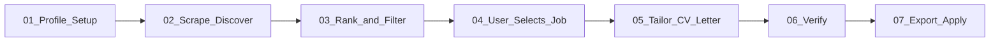

# Extern Job Intelligence System

A hybrid job search pipeline: a **deterministic TypeScript engine** for discovery, hard filtering, resume optimization planning, and tier classification — plus **agent skills** for LLM-heavy tailoring, cover letters, verification, and export.

> **You are a fresh-context agent.** Everything you need is in files. Read only what the task needs.
> These files are instructions, not documentation — act on them. Keep your own outputs light.

---

## Core Design Principle

Always separate three layers:

1. **(A) Hard filters** — visa, experience ceiling, licenses. Immediate reject. Never use LLM.
2. **(B) Fixable mismatches** — keyword gaps, framing. Handle via resume optimization. **Never reject before optimization.**
3. **(C) Strategic fit** — tier S/A/B/C/D classification **after** optimization.

---

## Pipeline Overview

### Stage 1: Profile Setup (`/setup`)
- Populate `library/context/experience/` (master truth), `library/profiles/` (function-specific presentation), `constraints.md` (hard filter inputs).
- Run: `npm run setup` or `skills/setup/`

### Stage 2: Job Discovery (`/scrape`)
- TinyFish Search + Fetch → normalized jobs in `workspace/jobs/normalized/`.
- Run: `npm run scrape` or `skills/scrape/`

### Stage 3: Rank & Filter (`/rank`)
- Classify job function → hard filters → resume optimization plan → tier S/A/B/C/D.
- Outputs: `workspace/jobs/ranked/{id}/` with `decision-report.json` and `optimized-resume-plan.json`.
- Rejected jobs: `workspace/jobs/rejected/`
- Run: `npm run rank` or `skills/rank/`

### Stage 4–7: Application Pipeline (existing skills)
- User selects a ranked job → `npm run apply <jobId>` seeds `workspace/applications/{company}-{role}/`
- **Tier S/A:** `skills/draft-review/` (drafter → reviewer → revise → export → verify)
- **Tier B quick path:** `skills/cv` → `skills/cover-letter` → `skills/verifier` → `skills/doc-export`

---

## Command Routing

| User wants... | Run | Skill |
|---|---|---|
| Set up profile | `npm run setup` | `skills/setup/` |
| Discover jobs | `npm run scrape` | `skills/scrape/` |
| Rank and filter jobs | `npm run rank` | `skills/rank/` |
| Start application on ranked job | `npm run apply <jobId>` | `skills/apply/` |
| Tailor CV + letter with review loop | — | `skills/draft-review/` (Tier S/A recommended) |
| Skill gap analysis | `npm run upskill` | `skills/upskill/` |
| Clear job pipeline | `npm run reset` | — |
| Tailor resume | — | `skills/cv/` |
| Write cover letter | — | `skills/cover-letter/` |
| Company research | — | `skills/company-research/` (gated) |
| Verify materials | — | `skills/verifier/` |
| Export PDF/Word | — | `skills/doc-export/` |
| Find single job manually | — | `skills/find-job/` |
| Voice feedback | — | `skills/learn/` |
| Edit the system | — | `skills/builder/` |

---

## Tier Classification (NOT fit scores)

| Tier | Meaning |
|---|---|
| **S** | Apply immediately — strong post-optimization alignment |
| **A** | Strong apply — minor preferred gaps |
| **B** | Conditional — decent alignment, uncertainty |
| **C** | Low ROI — technically possible, weak outcome |
| **D** | Reject — hard blockers or structural misalignment |

**Do NOT use verifier 0–100 scores for job tiering.** Tier engine handles job selection; verifier handles final material QA.

---

## Company Research Gate

**Do NOT run company research during scrape/rank.**

Only run `skills/company-research/` when:
- User explicitly selects a job for application, OR
- Job is Tier S AND user initiates apply workflow

---

## COLD-START: fill before you act

| If the user wants... | And this is still empty... | Ask for... |
|---|---|---|
| rank / apply | `library/context/experience/` stubs | their resume — run setup |
| hard filter accuracy | `library/context/constraints.md` | visa status, location, experience ceiling |
| tailoring | `library/context/voice/` placeholders | run voice build |
| behavioral prep | `library/context/stories/` | 2–3 STAR stories |

---

## Verification Protocol (`skills/verifier/`)

Verifier grades **final tailored materials only** — not job fit. Open `cv-v1.md` + `application.md` or `job.md`. Write report to application folder.

---

## Where things live

- `library/context/experience/` — master experience database (source of truth)
- `library/profiles/` — function-specific resume presentation layers
- `library/context/constraints.md` — hard filter inputs
- `workspace/jobs/` — scrape/rank pipeline (raw, normalized, ranked, rejected)
- `workspace/applications/` — application artifacts and tracker
- `ingestion/`, `engine/`, `resume/`, `commands/` — TypeScript pipeline
- `skills/` — agent instructions for LLM-heavy steps

---

## Context Discipline

- **Experience**: Read `library/context/experience/` files relevant to the job function profile.
- **Profiles**: Read the profile selected in `optimized-resume-plan.json` when tailoring.
- **Stories**: Scan ROSTER line only; read full body of selected stories.
- **Never fabricate** experience, years, or credentials in resume optimization.
