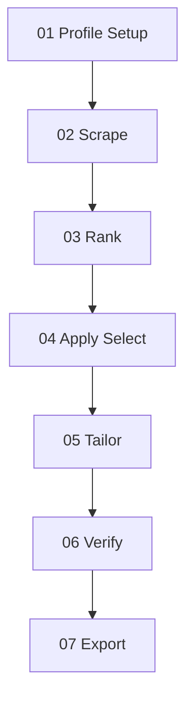

# Extern: Resume & Job Search Agent

<p align="center">
  
</p>

> **A personalized workspace and tailoring engine that lives inside your AI coding agent.** Tailor your resume, generate cover letters in your voice, research target companies, run strict mock ATS evaluations, and track your applications.

> Works with any agent that reads `AGENTS.md` (e.g. Claude Code, Gemini, Cursor, VS Code).

**Jump to**: [The Pipeline](#the-7-step-pipeline) · [Quick Start](#quick-start) · [System at a Glance](#system-at-a-glance) · [How it Works](#how-it-is-put-together) · [Connectors](#connectors)

---

## What this is (and isn't)

This is a **work-in-progress starter kit** built specifically for the **Extern cohort / members** to run their job search like a product. Instead of using generic prompt templates or renting subscription-based resume wrappers, this repository provides an open, file-native agent harness. You have direct, transparent access to every skill prompt (saved in `skills/`), meaning you can edit, customize, and extend the agent's behaviors as needed.

**This is a starting point, not a finished product.** The gap between a basic prompt and a personalized, production-grade agent is where the learning happens. As an Extern member, you are expected to take this template, customize the tailoring rules, expand the verification checklist, build your own custom voice profile, and extend the agent with new skills. By shaping the system yourself, you build a proprietary tool that you own and can discuss in interviews as concrete proof of your ability to build and orchestrate AI agents.

---

## The Pipeline

The system runs a **job intelligence pipeline** (scrape → rank) then an **application pipeline** (tailor → verify → export). See [workflow.md](library/process/workflow.md).



### Commands

```bash
npm install
npm run setup      # Initialize experience database
npm run scrape     # Discover jobs (TinyFish)
npm run rank       # Filter, optimize, tier jobs
npm run apply <id> # Seed application folder
npm run upskill    # Skill gap analysis
```

Set `TINYFISH_API_KEY` in `.env` for live scraping, or use `npm run scrape -- --mock` for testing.

---

## The 7-Step Pipeline (Application)

After `npm run apply <id>`, run the **draft-review** skill for Tier S/A jobs:
flowchart TB
  subgraph setup [Setup / Profile]
    P[search profile + ontology + constraints]
  end
  subgraph qgen [Query generation — new]
    QP[query_planner: families × skills × seniority × domain]
    EXP[optional LLM semantic expand → cached terms]
  end
  subgraph ingest [Ingestion]
    TF[TinyFish search/fetch]
    ATS[Greenhouse/Lever/Ashby for prioritized boards]
    PRE[cheap prefilter: snippet/titledomain + seniority hints]
    NORM[normalize + extract metadata]
  end
  subgraph rank [Rank — existing+]
    HF[hard filters]
    FEAT[domain + seniority scoring features]
    TIER[tier engine]
  end
  FB[apply/reject feedback] -.-> QP

  P --> QP
  EXP --> QP
  QP --> TF
  QP --> ATS
  TF --> PRE
  ATS --> PRE
  PRE --> NORM
  NORM --> HF --> FEAT --> TIER

> *"Run draft-review for my application to [company] [role]"*

This runs a drafter → reviewer → revise → export → verify loop. For faster Tier B applies, use `cv` and `cover-letter` directly.

---

## Quick Start

### 1 — Install VS Code
Download and install [VS Code](https://code.visualstudio.com/), a free code editor. You won't need to write code — it's just the home for your agent.

### 2 — Configure Your AI Agent
Add a coding agent extension. **Claude Code** is recommended, but other `AGENTS.md`-aware setups like Cursor, Gemini, or Codex also work. Connect your account and open the workspace.

### 3 — Setup Your Candidate Profile
The repository starts with empty `FILL-ME` templates in `library/context/`. When you first tell the agent to tailor a resume, it will notice they are blank and guide you through onboarding:
*   Paste your current resume to build `library/context/master-cv.md`.
*   Input your target roles and location in `positioning.md`.
*   Paste sample emails/writing to set up the voice profile in `voice/`.
*   Add 2-3 behavioral STAR stories in `stories/`.

### 4 — Run Your First Application Tailoring
Copy a job description URL or text, open the agent, and say:
> *"Tailor my resume for this Job Description: [paste text or URL]"*

The agent will scan the job, extract keywords, draft the CV and cover letter, and tell you how to verify them!

---

## System at a Glance

### Skills (`skills/`)
Each skill is a folder containing a `SKILL.md` file. They are simply prompt systems — you can open and edit them at any time.

| Skill / Command | What it does |
| :--- | :--- |
| `setup` | Initialize experience database, profiles, and constraints |
| `scrape` | Discover jobs via TinyFish, normalize to `workspace/jobs/` |
| `rank` | Hard filter, resume optimization plan, tier S/A/B/C/D |
| `apply` | Bridge ranked job into application folder |
| `draft-review` | Drafter-reviewer loop for CV + cover letter (Tier S/A recommended) |
| `upskill` | Skill gap analysis from Tier B/C jobs |
| `find-job` | Manual single-job pull (legacy path) |
| `company-research` | Writes a best-practice research prompt to create a cited brief on the company's business. |
| `cv` | Tailors a single-page, keyword-dense resume from your master CV. |
| `cover-letter` | Drafts a one-page cover letter matching your natural tone; drafts outreach emails. |
| `verifier` | Audits tailored materials. Scores resumes (0-100) based on complexity and link quality; flags generic AI tells in letters. |
| `doc-export` | Exports finished markdown into print-ready, ATS-safe HTML/PDF templates or `.docx` files. |
| `learn` | Feeds your manual edits back into your voice profile as before/after pairs. |
| `builder` | The system-configuration mode used when you want the agent to add new skills or modify behavior. |

### Repository Structure

```text
extern-resume-and-job-search-agent/
├── AGENTS.md                 # Master agent rules, routing, and workflows
├── CLAUDE.md                 # Minimal Claude Code loader
├── README.md
├── .env.example              # Optional Composio keys
├── library/
│   ├── context/              # Your CV, stories, voice profiles, target positioning (ships as empty FILL-ME stubs)
│   └── process/
│       └── workflow.md       # The 7-step pipeline definition
├── skills/                   # Tailoring, research, verifier, learn, and export prompts
└── workspace/
    └── applications/
        ├── tracker.EXAMPLE.md # Reference funnel tracking dashboard
        ├── EXAMPLE-meridian-business-analyst/ # Reference tailored application (undergrad finance/economics role)
        └── EXAMPLE-vanguard-analyst/          # Reference tailored, verified, and PDF-exported application (operations role)
```

---

## How it is Put Together

*   **File-Native**: Your CV, stories, positioning, and applications exist as local markdown files. The agent always knows where to pick up, and you maintain a permanent, offline record of your search.
*   **Token-Efficient**: The agent only reads what is needed for the active step (e.g. reading only the STAR story headers instead of the full bodies during selection) to keep API costs low and prevent model hallucination.
*   **Print-to-PDF Formatting**: To avoid MS Word formatting breaking, the `doc-export` skill generates clean HTML. Printing this HTML file from your browser (Ctrl/Cmd+P → Save as PDF) yields a perfect, single-page, ATS-safe PDF.

---

## Connectors

Connect **Composio** to allow the agent to interface with your Google Docs, Gmail, or Calendar accounts. The agent can then automatically push tailored resumes to Google Docs or prepare draft follow-up emails in your Gmail draft folder. Full setup instructions are located in [connectors.md](library/context/connectors.md).

---

## License

**MIT** — see [LICENSE](LICENSE) for details. Helper libraries (`skills/docx/` and `skills/humanizer/`) carry their respective open-source licenses.

---

*Built for the Extern cohort — take it, build it, and make it your own.*
