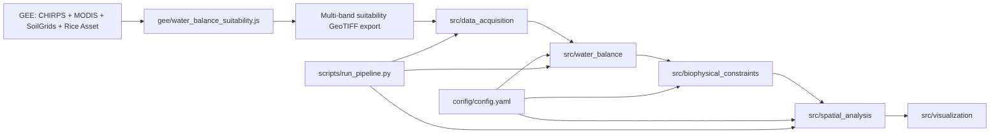

# Master Portfolio: AWD Scientific Software Audit

## Project Overview

This repository implements a geospatial decision-support workflow for assessing Alternative Wetting and Drying (AWD) suitability, primarily using Google Earth Engine (GEE) for raster production and Python modules for downstream analytics, classification, and reporting.

The core demonstrated competencies are:

1. Earth observation data integration across rainfall, evapotranspiration, soil, terrain, and rice extent layers.
2. Raster harmonization into a common analysis grid.
3. Dekad water-balance computation and threshold-based suitability mapping.
4. Biophysical constraint integration and spatial fragmentation analysis.
5. Configuration-driven reproducibility with documented workflow guidance.

Execution reality in this snapshot:

1. GEE pipeline is the operational core and is fully present.
2. Python analytical modules exist and contain implemented logic.
3. Several docs claim additional scripts/directories not present in the current tree.

## Scientific Motivation

The scientific problem is suitability mapping: which geographical units are suitable for Altertive Wet Drying and which tier of suitabiltiy, based on classification of water balance and biophysical suitability. The repository operationalizes this as a water-availability and landscape-feasibility problem over rice areas.

Recovered scientific framing:

1. AWD requires periodic water deficit but not severe crop stress.
2. Suitability should be evaluated across deficit thresholds, not a single cutoff.
3. Feasibility depends on hydrology plus terrain and soil drainage.
4. Spatial contiguity affects deployment economics, not just biophysical potential.

## Repository Architecture

### Architecture Operations (Three-Level)

| Level 1 | Level 2 | Level 3 |
|---|---|---|
| Pipeline orchestration | Structured multi-stage analysis from ingestion to reporting | [scripts/run_pipeline.py](scripts/run_pipeline.py) defines validation, water-balance sensitivity, regional stats, and output write stages |
| Modular scientific code design | Decomposed hydrology, constraints, spatial analysis, and visualization into separate modules | [src/water_balance/__init__.py](src/water_balance/__init__.py), [src/biophysical_constraints/__init__.py](src/biophysical_constraints/__init__.py), [src/spatial_analysis/__init__.py](src/spatial_analysis/__init__.py), [src/visualization/__init__.py](src/visualization/__init__.py) |
| Cloud-plus-local workflow | Uses GEE for heavy raster computation and Python for post-processing | [gee/water_balance_suitability.js](gee/water_balance_suitability.js) + [src/data_acquisition/__init__.py](src/data_acquisition/__init__.py) |

## Earth Observation Pipeline

### Recovered EO datasets

1. CHIRPS daily precipitation: UCSB-CHG/CHIRPS/DAILY.
2. MODIS PET: MODIS/061/MOD16A2.
3. SoilGrids texture: clay_mean and sand_mean assets.
4. SRTM DEM (documented for slope constraint logic).
5. User-provided rice extent asset.

### EO Operations (Three-Level)

| Level 1 | Level 2 | Level 3 |
|---|---|---|
| Raster ingestion | Pulled multi-source satellite and gridded products from GEE catalog/assets | CHIRPS, MOD16A2, SoilGrids images loaded in [gee/water_balance_suitability.js](gee/water_balance_suitability.js) |
| Temporal aggregation | Converted native daily and 8-day products into dekad-ready inputs | CHIRPS 10-day sum via filterDate+sum; MODIS 8-day PET weighted by overlap days in [gee/water_balance_suitability.js](gee/water_balance_suitability.js) |
| Harmonization of spatial support | Forced all layers to common CRS/scale and rice mask support | `reproject({crs:'EPSG:4326', scale:500})`, categorical mode reduction, bilinear resampling, and rice-mask update in [gee/water_balance_suitability.js](gee/water_balance_suitability.js) |
| EO feature engineering | Derived dekad rainfall-with-irrigation, dekad PET, and soil percolation rasters | `addMinimumIrrigation`, `computeDekadPET`, and `computePercolationRate` in [gee/water_balance_suitability.js](gee/water_balance_suitability.js) |
| Multi-threshold product generation | Emitted a multi-band suitability stack for sensitivity analysis | Loop over `deficitThresholds` and `toBands()` export in [gee/water_balance_suitability.js](gee/water_balance_suitability.js) |

### Remote sensing specifics recovered

1. Spectral variables directly used: none (no raw optical bands/indexes in the implemented GEE script).
2. Hydrometeorological remote-sensing variables used: precipitation and PET.
3. Cloud masking: not implemented in active code path because selected datasets are already aggregated geophysical products.
4. Raster algebra: implemented extensively in WB equation and suitability logic.

## Hydrological Modeling

The repository implements a dekad water balance model following MapAWD-style logic.

Water balance formulation used:

$$WB_t = P_t - (PET_t + Perc_t)$$

### Hydrological Operations (Three-Level)

| Level 1 | Level 2 | Level 3 |
|---|---|---|
| Water balance computation | Combined rainfall, evapotranspiration, and percolation losses per dekad | `rainWithIrr.subtract(pet).subtract(potPcFinal)` in [gee/water_balance_suitability.js](gee/water_balance_suitability.js); equivalent scalar function in [src/water_balance/__init__.py](src/water_balance/__init__.py) |
| Irrigation fallback modeling | Applied minimum effective rainfall threshold to represent supplemental irrigation floor | `rain < threshold ? threshold : rain` in [gee/water_balance_suitability.js](gee/water_balance_suitability.js); `np.maximum` in [src/water_balance/__init__.py](src/water_balance/__init__.py) |
| Percolation parameterization | Mapped soil texture classes to percolation rates and converted to dekad totals | Soil class remap to 3/4/9/12 mm/day then ×10 in [gee/water_balance_suitability.js](gee/water_balance_suitability.js); similar logic in [src/biophysical_constraints/__init__.py](src/biophysical_constraints/__init__.py) |
| Crop-season phase handling | Excluded establishment and harvest windows from suitability counting | `excludeFirstDekads`, `excludeLastDekads` in [gee/water_balance_suitability.js](gee/water_balance_suitability.js) and [config/config.yaml](config/config.yaml) |
| Threshold sensitivity modeling | Swept multiple deficit thresholds to evaluate robustness of suitability | Threshold array [-25..-150] in [gee/water_balance_suitability.js](gee/water_balance_suitability.js) and `analyze_threshold_sensitivity` in [src/water_balance/__init__.py](src/water_balance/__init__.py) |

### Hydrological assumptions recovered

1. PET from MOD16A2 is acceptable proxy for dekad atmospheric demand.
2. Soil percolation can be approximated from topsoil texture classes.
3. Fixed season window (dekads 10-28) applies to target rice systems.
4. AWD suitability requires negative WB but above stress threshold.
5. Supplemental irrigation is represented as thresholded rainfall floor.

## Spatial Analysis

The spatial analysis layer focuses on patch structure, regional aggregation, and deployment implications.

### GIS Operations (Three-Level)

| Level 1 | Level 2 | Level 3 |
|---|---|---|
| Reprojection and resampling | Brought mixed-resolution data into a consistent 500 m grid | categorical `reduceResolution(mode)` and continuous bilinear resample in [gee/water_balance_suitability.js](gee/water_balance_suitability.js) |
| Clipping and masking | Restricted all calculations to rice AOI and rice-mask support | `.clip(riceAOI)` and `.updateMask(riceMask500m)` in [gee/water_balance_suitability.js](gee/water_balance_suitability.js) |
| Raster overlay logic | Combined slope, drainage, and WB suitability as logical constraints | `compute_biophysical_suitability` boolean conjunction in [src/biophysical_constraints/__init__.py](src/biophysical_constraints/__init__.py) |
| Connected components analysis | Quantified patch count and patch-size distribution | `scipy.ndimage.label` and patch-size bin counts in [src/spatial_analysis/__init__.py](src/spatial_analysis/__init__.py) |
| Cluster extraction | Identified large suitable clusters for targeting | `identify_suitability_clusters` in [src/spatial_analysis/__init__.py](src/spatial_analysis/__init__.py) |
| Regional zonal aggregation | Computed suitability percentages by region IDs | `compute_regional_statistics` in [src/spatial_analysis/__init__.py](src/spatial_analysis/__init__.py) |
| Coarsening / grid aggregation | Downsampled suitability map for lighter products | `aggregate_to_grid` in [src/data_acquisition/__init__.py](src/data_acquisition/__init__.py) |

### Additional GIS capabilities documented but partially implemented

1. Terrain slope from SRTM is documented and implemented in Python module.
2. Distance-based connectivity thresholds are parameterized in config, but no explicit distance-transform operation is executed in current scripts.
3. No explicit vector-based zonal statistics workflow is present; aggregation is raster-ID based.

## Remote Sensing

### Remote-sensing competency inventory

| Level 1 | Level 2 | Level 3 |
|---|---|---|
| EO product selection | Selected climate, ET, and soil products consistent with AWD hydrology | CHIRPS + MODIS PET + SoilGrids in [gee/water_balance_suitability.js](gee/water_balance_suitability.js) and [docs/data_sources.md](docs/data_sources.md) |
| Temporal harmonization across products | Reconciled daily precipitation and 8-day PET to dekads | Dekad date generator + weighted overlap PET in [gee/water_balance_suitability.js](gee/water_balance_suitability.js) |
| Soil-feature derivation from EO rasters | Converted sand/clay rasters into drainage/percolation classes | texture rule set and remap in [gee/water_balance_suitability.js](gee/water_balance_suitability.js) |
| Multi-scenario raster generation | Produced scenario bands for policy sensitivity | one output band per deficit threshold in [gee/water_balance_suitability.js](gee/water_balance_suitability.js) |
| EO export engineering | Exported reproducible GeoTIFF stack with fixed CRS and scale | `Export.image.toDrive` block in [gee/water_balance_suitability.js](gee/water_balance_suitability.js) |

### What is not demonstrated in active code

1. Pixel-level spectral index calculation (NDVI, EVI, NDWI) is not implemented.
2. Cloud and shadow masking pipelines are not implemented.
3. Surface reflectance compositing workflow is not implemented.

## Environmental Modeling

This repository models environmental suitability as a multi-constraint environmental envelope.

### Environmental modeling operations (Three-Level)

| Level 1 | Level 2 | Level 3 |
|---|---|---|
| Constraint-based suitability modeling | Combined hydroclimate and terrain/soil constraints into feasibility output | boolean suitability assembly in [src/biophysical_constraints/__init__.py](src/biophysical_constraints/__init__.py) |
| Agro-environmental thresholding | Encoded practical AWD stress limits as deficit thresholds | threshold sweep implemented in [src/water_balance/__init__.py](src/water_balance/__init__.py) and GEE script |
| Extension-cost proxy modeling | Linked spatial fragmentation to implementation cost multipliers | `estimate_extension_cost` in [src/spatial_analysis/__init__.py](src/spatial_analysis/__init__.py) |
| Comparative environmental transfer assessment | Compared suitability landscape structure between two systems | `compare_fragmentation` in [src/spatial_analysis/__init__.py](src/spatial_analysis/__init__.py) |

## Validation

### Validation operations recovered

| Level 1 | Level 2 | Level 3 |
|---|---|---|
| Input validation | Checked study extents and parameter sanity before processing | `validate_bounding_box` in [src/utils.py](src/utils.py) and validation steps in [scripts/run_pipeline.py](scripts/run_pipeline.py) |
| Raster output validation | Verified band count, value ranges, and nodata proportions | `validate_water_balance_data` in [src/data_acquisition/__init__.py](src/data_acquisition/__init__.py) |
| Threshold robustness validation | Evaluated output sensitivity to deficit cutoff choices | `analyze_threshold_sensitivity` in [src/water_balance/__init__.py](src/water_balance/__init__.py) |
| Spatial plausibility checks | Documented qualitative map inspection and region-level breakdown checks | [docs/methodology.md](docs/methodology.md) and [docs/reproduction_guide.md](docs/reproduction_guide.md) |

### Validation posture in this snapshot

1. Strong internal consistency checks for numeric and configuration logic.
2. No dedicated unit test suite present in repository tree despite references in docs.
3. No external benchmark dataset ingestion in the executable pipeline.

## Sensitivity Analysis

Deficit-threshold sweeps are a central methodological component.

### Sensitivity operations (Three-Level)

| Level 1 | Level 2 | Level 3 |
|---|---|---|
| Threshold uncertainty quantification | Tested AWD suitability response across 7 deficit scenarios | thresholds `[-25,-50,-70,-90,-110,-130,-150]` in [gee/water_balance_suitability.js](gee/water_balance_suitability.js) and [config/config.yaml](config/config.yaml) |
| Scenario result aggregation | Collected fraction suitable, class, and percentages for each threshold | DataFrame outputs from `analyze_threshold_sensitivity` in [src/water_balance/__init__.py](src/water_balance/__init__.py) |
| Communicable uncertainty outputs | Prepared visual and tabular products for threshold effects | sensitivity plot function in [src/visualization/__init__.py](src/visualization/__init__.py), and output steps in [scripts/run_pipeline.py](scripts/run_pipeline.py) |

## Software Engineering

### Reproducible science operations (Three-Level)

| Level 1 | Level 2 | Level 3 |
|---|---|---|
| Parameterization | Centralized model and geoprocessing parameters in one config artifact | [config/config.yaml](config/config.yaml) contains thresholds, season windows, data sources, regions, and output settings |
| Pipeline orchestration | Encapsulated end-to-end workflow with CLI entry point | AWDPipeline class and CLI args in [scripts/run_pipeline.py](scripts/run_pipeline.py) |
| Environment management | Pinned scientific/geospatial dependencies | [requirements.txt](requirements.txt) includes rasterio, geopandas, pyproj, earthengine-api, scipy stack |
| Documentation for replication | Provided methodology, source catalog, and runbook | [docs/methodology.md](docs/methodology.md), [docs/data_sources.md](docs/data_sources.md), [docs/reproduction_guide.md](docs/reproduction_guide.md) |
| Figure generation | Implemented map and sensitivity visualization utilities | [src/visualization/__init__.py](src/visualization/__init__.py) and generated files under [outputs/figures](outputs/figures) |

### Engineering risks detected

1. Configuration-key mismatch between [scripts/run_pipeline.py](scripts/run_pipeline.py) and [config/config.yaml](config/config.yaml) likely prevents clean execution without edits.
2. Repository claims scripts like `generate_figures.py` and `sensitivity_analysis.py`, but they are absent from [scripts](scripts).
3. `notebooks` folder is referenced in docs but absent in tree.

## Resume Keyword Matrix

| Domain | Resume-ready keywords | Evidence |
|---|---|---|
| Remote sensing | Google Earth Engine, CHIRPS, MODIS MOD16A2, SoilGrids, geospatial raster analytics | [gee/water_balance_suitability.js](gee/water_balance_suitability.js), [docs/data_sources.md](docs/data_sources.md) |
| GIS engineering | Reprojection, resampling, clipping, masking, multi-resolution harmonization | [gee/water_balance_suitability.js](gee/water_balance_suitability.js) |
| Hydrological modeling | Dekad water balance, PET integration, percolation parameterization, irrigation threshold logic | [src/water_balance/__init__.py](src/water_balance/__init__.py), [gee/water_balance_suitability.js](gee/water_balance_suitability.js) |
| Spatial statistics | Connected components, fragmentation index, regional suitability aggregation | [src/spatial_analysis/__init__.py](src/spatial_analysis/__init__.py) |
| Environmental modeling | Constraint overlay modeling, terrain-drainage feasibility, threshold sensitivity analysis | [src/biophysical_constraints/__init__.py](src/biophysical_constraints/__init__.py), [src/water_balance/__init__.py](src/water_balance/__init__.py) |
| Reproducible science | Config-driven pipeline, dependency pinning, methodological documentation | [config/config.yaml](config/config.yaml), [requirements.txt](requirements.txt), [docs/reproduction_guide.md](docs/reproduction_guide.md) |

## Resume Translation Matrix

| Target role | Job-posting framing (resume bullets) | ATS keywords to include | Repository evidence to cite |
|---|---|---|---|
| Geospatial Engineer | Engineered an end-to-end geospatial raster pipeline in Google Earth Engine and Python to produce multi-threshold AWD suitability surfaces for policy targeting. Harmonized mixed-resolution climate, soil, and land-use rasters into a common 500 m analysis grid with reproducible exports. | geospatial pipeline engineering, raster harmonization, reprojection, resampling, spatial ETL, Google Earth Engine, GeoTIFF export, Python geospatial stack, reproducible geospatial workflows | [gee/water_balance_suitability.js](gee/water_balance_suitability.js), [src/data_acquisition/__init__.py](src/data_acquisition/__init__.py), [scripts/run_pipeline.py](scripts/run_pipeline.py), [config/config.yaml](config/config.yaml) |
| GIS Analyst | Produced interpretable suitability maps and region-level summaries for agricultural water-management feasibility. Applied masking, clipping, class-based suitability scoring, and spatial aggregation to support evidence-based planning decisions. | GIS analysis, suitability mapping, thematic mapping, spatial overlay, regional statistics, map interpretation, land suitability, geospatial reporting | [src/visualization/__init__.py](src/visualization/__init__.py), [src/spatial_analysis/__init__.py](src/spatial_analysis/__init__.py), [outputs/figures/awd-composite-map.png](outputs/figures/awd-composite-map.png), [outputs/figures/awd-biophysical-map.png](outputs/figures/awd-biophysical-map.png) |
| Remote Sensing Analyst | Integrated CHIRPS precipitation, MODIS PET, and SoilGrids texture layers into dekad-scale water-balance features and threshold-based remote-sensing indicators. Implemented temporal alignment (daily/8-day to dekad), raster algebra, and sensitivity sweeps to quantify uncertainty in suitability outcomes. | remote sensing analysis, CHIRPS, MODIS MOD16A2, SoilGrids, temporal aggregation, raster algebra, environmental indicators, uncertainty analysis, threshold sensitivity | [gee/water_balance_suitability.js](gee/water_balance_suitability.js), [src/water_balance/__init__.py](src/water_balance/__init__.py), [docs/data_sources.md](docs/data_sources.md), [docs/methodology.md](docs/methodology.md) |

### Role-targeting notes for applications

1. For Geospatial Engineer applications, emphasize pipeline robustness and productionization language: harmonization, export automation, modular orchestration, and reproducibility.
2. For GIS Analyst applications, emphasize deliverables and communication language: suitability maps, regional breakdowns, and policy-facing interpretation.
3. For Remote Sensing Analyst applications, emphasize EO methods language: dataset fusion, temporal alignment, dekad feature engineering, and threshold-based uncertainty framing.

## STAR Stories

### 1) Multi-source EO harmonization for decision mapping

Situation: AWD suitability required combining rainfall, evapotranspiration, soil texture, and crop extent from different products and resolutions.

Task: Build a single comparable analysis grid suitable for pixel-level modeling.

Action: Implemented GEE preprocessing that clips to rice AOI, reprojects to EPSG:4326 at 500 m, uses mode for categorical upscaling and bilinear interpolation for continuous layers, then masks non-rice pixels.

Result: Produced harmonized raster stack enabling consistent water-balance suitability computation across thresholds.

### 2) Hydrological threshold sensitivity for robust recommendations

Situation: Single-threshold AWD assessments can be brittle and policy-sensitive.

Task: Quantify suitability robustness across multiple deficit assumptions.

Action: Ran 7 deficit thresholds from -25 to -150 mm and generated per-threshold suitability classes and fractions.

Result: Decision support includes an uncertainty band rather than one deterministic classification.

### 3) Translating suitability maps into deployment cost implications

Situation: Suitable area percentage alone does not capture implementation feasibility.

Task: Measure spatial fragmentation and infer extension burden.

Action: Applied connected-component analysis to compute patch statistics and fragmentation indices, then estimated cost multipliers tied to fragmentation.

Result: Added operational planning value by connecting spatial pattern to implementation economics.

### 4) Reproducible science packaging

Situation: Policy analysis needed reproducible reruns and transparent assumptions.

Task: Make workflow parameterized and auditable.

Action: Centralized thresholds, season windows, sources, and output settings in YAML; documented full method and replication steps.

Result: Pipeline assumptions are inspectable and modifiable without changing core code.

## Interview Questions

1. How did you reconcile daily CHIRPS and 8-day MODIS PET into a dekad water-balance timeline?
2. Why is bilinear resampling used for continuous layers and mode for categorical layers?
3. What hydrological assumptions are implicit in mapping soil texture to fixed percolation rates?
4. How do exclusion windows alter AWD suitability estimates?
5. Why use a threshold sweep rather than a single deficit threshold?
6. How would you validate PET-driven WB results against station or field data?
7. What does your fragmentation index capture, and what does it miss?
8. How would you incorporate uncertainty from CHIRPS and SoilGrids into final suitability confidence?
9. If you had to operationalize this nationally, where are the computational bottlenecks?
10. How would you extend the model to include groundwater and managed irrigation schedules?

## Evidence Mapping

### Core implementation

1. [gee/water_balance_suitability.js](gee/water_balance_suitability.js)
2. [scripts/run_pipeline.py](scripts/run_pipeline.py)
3. [src/water_balance/__init__.py](src/water_balance/__init__.py)
4. [src/biophysical_constraints/__init__.py](src/biophysical_constraints/__init__.py)
5. [src/spatial_analysis/__init__.py](src/spatial_analysis/__init__.py)
6. [src/data_acquisition/__init__.py](src/data_acquisition/__init__.py)
7. [src/visualization/__init__.py](src/visualization/__init__.py)
8. [src/utils.py](src/utils.py)

### Configuration and reproducibility

1. [config/config.yaml](config/config.yaml)
2. [requirements.txt](requirements.txt)
3. [docs/reproduction_guide.md](docs/reproduction_guide.md)
4. [docs/methodology.md](docs/methodology.md)
5. [docs/data_sources.md](docs/data_sources.md)
6. [gee/README.md](gee/README.md)

### Produced outputs present in snapshot

1. [outputs/figures/awd-originalWB.png](outputs/figures/awd-originalWB.png)
2. [outputs/figures/awd-composite-map.png](outputs/figures/awd-composite-map.png)
3. [outputs/figures/awd-biophysical-map.png](outputs/figures/awd-biophysical-map.png)
4. [outputs/figures/awd-thresh-25.png](outputs/figures/awd-thresh-25.png)
5. [outputs/figures/awd-thresh-50.png](outputs/figures/awd-thresh-50.png)
6. [outputs/figures/awd-thresh-70.png](outputs/figures/awd-thresh-70.png)
7. [outputs/figures/awd-thresh-90.png](outputs/figures/awd-thresh-90.png)
8. [outputs/figures/awd-thresh-110.png](outputs/figures/awd-thresh-110.png)
9. [outputs/figures/awd-thresh-130.png](outputs/figures/awd-thresh-130.png)
10. [outputs/figures/awd-thresh-150.png](outputs/figures/awd-thresh-150.png)

## Unknowns

1. README and project structure documents reference scripts and folders not present in current tree, including notebooks and additional scripts.
2. End-to-end execution viability is uncertain due to config key mismatches between [scripts/run_pipeline.py](scripts/run_pipeline.py) and [config/config.yaml](config/config.yaml).
3. No committed tables under outputs were found; only figure artifacts are present.
4. Cloud masking and spectral index workflows are described at high level but not implemented in active code.
5. External ground-truth validation datasets are not bundled in snapshot.
6. Distance-based connectivity parameter exists in config but no explicit distance-transform implementation is wired in runtime code.
