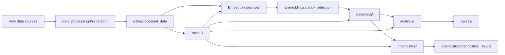

# Master Portfolio: Capstone Thesis Audit

## 1. Project Overview

This repository is not just a collection of scripts. It is a reproducible research system for studying how wildfire exposure relates to future wildfire risk in California forests, using satellite-derived fire observations, remote-sensing covariates, spatial harmonization, embedding-based donor selection, and calibrated propensity score weighting.

The strongest signal in the codebase is that the project is built like a data engineering pipeline rather than a one-off analysis. Raw sources are downloaded, standardized to a shared spatial grid, reduced into analysis tables, filtered into treatment/control cohorts, passed through embedding and CBPS selection, and then evaluated with diagnostics, placebo logic, and robustness checks. That is exactly the workflow expected from a spatial data engineer or research scientist who can run end-to-end geospatial causal inference.

What this repository demonstrates about technical ability is broader than the paper result. It shows the ability to:

1. Design a multi-language R + Python research stack.
2. Build spatial preprocessing pipelines around multiple coordinate systems and raster formats.
3. Construct panel data from remote sensing and fire history sources.
4. Build an embedding-selection pipeline that reduces a donor pool without destroying balance.
5. Implement calibrated propensity score weighting and diagnostics.
6. Orchestrate long-running reproducible workflows with caching, atomic writes, and batch scripts.

## 2. Repository Architecture

The architecture is hybrid and layered:

1. `data_processing/Preparation/` creates spatially harmonized input datasets.
2. `Embeddings/` converts Earth-observation tiles into dense pixel embeddings, then selects donor pools by K.
3. `balancing/` implements covariate balancing synthetic control and ATT weighting.
4. `analysis/` turns the estimated weights into outcome trajectories and figures.
5. `diagnostics/` validates lambda selection, covariate balance, and robustness criteria.
6. `env/` and `config/` keep the pipeline reproducible.

The repository is intentionally not a web app or service. It is a research pipeline that behaves like production software: configurable, cache-aware, file-backed, and staged.

## 3. End-to-End Data Pipeline

### Pipeline Stages

| Level 1: Competency | Level 2: Workflow | Level 3: Implementation |
|---|---|---|
| Research pipeline orchestration | Sequenced data prep, embedding extraction, K selection, CBPS, outcome analysis, and diagnostics | `main.R` reads `config/config.yaml`, calls `data_processing/process_analysis_data.R`, `Embeddings/scripts/02_extract_embeddings_single_year.py`, `Embeddings/scripts/03_select_optimal_k.py`, `Embeddings/scripts/04_run_cbps_with_selected_controls.R`, then `analysis/` and `diagnostics/` scripts |
| Data lineage control | Preserved intermediate datasets as named artifacts | `data/processed_data/FIRMS.RDS`, `tree_cover.fst`, `gridClimate_mon2_conifer.fst`, `analysis_treated<year>_conifer.RDS`, `cbps_weights_<year>_conifer.RDS`, `k_selection` outputs |
| Reproducibility | Centralized parameters and deterministic outputs | `config/config.yaml`, `env/environment-capstone-r-spatial.yml`, `REPRODUCE.md`, `scripts/validate_environment.sh`, `scripts/run_pipeline.sh` |

### End-to-End Flow

1. **Acquire raw geospatial sources.** The project starts from multiple public and semi-public Earth-observation sources: FIRMS active fire, Daymet climate, GPW population grid, fractional vegetation cover, disturbance rasters, MTBS and RAVG severity, CAL FIRE vegetation and prescribed fire data, and ESD tiles for embeddings.
2. **Normalize coordinates and grid structure.** The spatial workflows convert heterogeneous datasets into the conifer analysis grid and common coordinate systems, usually WGS84 for vector alignment and projected grids for raster extraction.
3. **Build panel covariates.** Pre-treatment annual and monthly covariates are merged per unit-year and saved as RDS/FST artifacts.
4. **Generate embeddings.** The ESD pipeline downloads tiles, extracts 72-dimensional pixel embeddings, and caches similarities.
5. **Select control pools.** K-selection scripts compute donor pool diagnostics and choose an optimal K or K policy.
6. **Fit CBPS weights.** Filtered donor pools are passed through covariate balancing synthetic control to estimate ATT weights.
7. **Compute outcomes.** Weighted fire-frequency and intensity summaries are produced across lags and cohorts.
8. **Run diagnostics.** Covariate balance, placebo, sensitivity, and lambda diagnostics validate the design.

The important thing is that each step writes an artifact that the next step consumes. That makes the workflow auditable and restartable.

## 4. Satellite Data Engineering

### Dataset Inventory

| Dataset | Why selected | Spatial resolution | Temporal resolution | CRS / grid | Storage format | Preprocessing | Derived variables | Role downstream | Relationships |
|---|---|---|---|---|---|---|---|---|---|
| MODIS FIRMS active fire | Treatment/exposure source for fire intensity and location | Point observations, snapped to CA grid | Daily / event-based | WGS84 then conifer grid | SHP, RDS | Spatial join to GPW grid, dedup by year, aggregation by LAT/LON/year | `avg_BRIGHTNESS`, `max_FRP`, `avg_FRP` | Defines treated units and fire-frequency outcomes | Feeds `process_analysis_data.R`, `fire_behaviors.R`, `prescribed_fire.R` |
| Daymet monthly climate | Time-varying covariates for balance and matching | 1 km monthly gridded climate | Monthly, 2000–2020 | Daymet Lambert Conformal Conic | NetCDF (`*.nc`), FST | Download from Planetary Computer / Azure Zarr, projected coordinate transform, nearest-neighbor / IDW onto conifer grid | Monthly `minat`, `maxat`, `prcp`, `wvp`, `swe` | Core pre-treatment covariates | Feeds `daymet.R`, `process_analysis_data.R`, anomaly construction in CBPS prep |
| GPW grid | Canonical spatial sampling grid for California | Raster-derived points | Static | EPSG:4326 | RDS | Extracted from raster points and clipped to California | `LONGITUDE`, `LATITUDE` | Shared unit grid for all data alignment | Foundation for vegetation and FIRMS snapping |
| Vegetation class / conifer mask | Restricts analysis to forested pixels | Grid cell polygons | Static or slowly changing | EPSG:4326 and mask CRS | RDS, CSV, TIF | Centroid extraction against conifer mask, polygon creation | `conifer` flag | Defines study population | Feeds `vegetation_class.R`, `process_analysis_data.R` |
| Fractional vegetation cover | Annual vegetation covariate | 30 m raster | Annual, 2000–2020 | Raster CRS matched to conifer grid | TIF -> FST | Exact extraction with `exactextractr`, mean per polygon | Tree-cover series | Balance and matching covariate | Feeds `fractional_cover.R`, CBPS design |
| Disturbance rasters | Disturbance covariates for landscape history | 5 km tiles, resampled to grid | Annual bands, 2000–2020 | Native tile CRS, then WGS84 grid | TIF -> FST | Crop, transform, extract by year, summarize classes | `fire`, `timber`, `drought`, `greening`, `browning` | Long-run disturbance history in matching | Feeds `disturbance.R`, pre-treatment covariates |
| MTBS | Burn severity history | 30 m | Annual | Native raster, later projected to WGS84 | TIF, CSV, RDS | Mask to conifer grid, project raster, modal extraction to polygons | Severity class counts | Historical burn severity covariate and validation source | Feeds `fire_severity.R` and crosswalk tables |
| RAVG / CBI4 | Alternative fire severity measures | 30 m | Annual | Native raster, then California boundary | TIF, CSV | Crop/mask California, classify severity bins | Severity distribution | Cross-validation against MTBS and FRP | Feeds `fire_severity.R` tables |
| CAL FIRE vegetation / patch features | Additional vegetation structure and conifer patch context | Vector / raster-derived | Static / occasional | Local CA geometry | SHP / RDS | Patch filtering by conifer codes, centroid/grid mapping | Patch composition / conifer mask | Supports vegetation-driven study population | Feeds vegetation mask workflow |
| CAL FIRE / FACTS prescribed fires | Separate prescribed-fire exposure source | Vector polygons | Annual | Transformed to FIRMS CRS / grid CRS | GDB / SHP | Spatial intersection with FIRMS and filtering by fire type | Prescribed-fire indicator | Used to exclude or classify prescribed burns | Feeds `prescribed_fire.R` |
| ESD tiles | Foundation-model image source for embeddings | 30 m MGRS tiles | Annual focal year with monthly bands | MGRS / GeoTIFF transform | GeoTIFF, CSV caches | Download by URL, tile lookup by MGRS, QA gating, dequantization | 72-dim pixel embedding | Donor pool selection and support diagnostics | Feeds `02_extract_embeddings_single_year.py` and K-selection |

### Why these datasets matter

This is a deliberately multi-source satellite workflow. The project is not relying on one canonical raster. It is triangulating wildfire risk from active fire, vegetation, climate, severity, disturbance, and static geography. That demonstrates an understanding of remote sensing as a compositional data problem:

1. Fire is an outcome and a treatment proxy.
2. Vegetation and disturbance are baseline structure.
3. Climate is temporal forcing.
4. Severity products validate or complement fire intensity.
5. The embeddings layer compresses raw Earth-observation content into a retrieval space.

## 5. Geospatial Processing Operations

### Operations Ladder

| Level 1: Competency | Level 2: Workflow | Level 3: Implementation |
|---|---|---|
| Spatial grid design | Created a common California analysis grid and projected all sources onto it | `gpw_grid_ca.RDS`, centroid-based polygon creation, conifer mask extraction, `st_transform`, `st_join`, `terra::extract`, `raster::mask` |
| Raster harmonization | Resampled rasters into common grids for exact extraction and panel construction | `exactextractr::exact_extract`, `projectRaster(..., method = "ngb")`, `terra::rast`, `st_crop`, `st_make_valid` |
| Coordinate transformations | Moved between WGS84, raster CRS, and projected CRS depending on the task | `pyproj.Transformer`, `st_transform`, `terra::crs`, GeoTIFF transform metadata, `rowcol` / `rio_transform` |
| Panel construction | Turned spatial point data into unit-year tables | `merge`, `group_by(year, unit)`, `summarise`, `Reduce(merge, ...)`, full panel expansion with all units x years |
| QC and anomaly handling | Removed missingness and standardized covariates safely | NA imputation thresholds, winsorization, z-scoring, MAD standardization, dropping near-constant columns |
| Spatial sampling | Transformed coordinate clicks into raster cells and nearest burnable points | `warp_transform`, `st_nearest_feature`, nearest-cell selection, MGRS tile lookup, exact row/column extraction |

### What the spatial engineering shows

The project repeatedly solves the same hard problem: geospatial variables rarely arrive in the same geometry, same CRS, same shape, or same temporal support. The code addresses that by:

1. Choosing a canonical conifer grid.
2. Reprojecting raster inputs before extraction.
3. Using centroid/polygon representations where polygonal support matters.
4. Falling back to nearest-neighbor or modal aggregation when data are categorical.
5. Using exact extraction or IDW only where the source structure supports it.

This is strong evidence of practical GIS maturity.

## 6. Wildfire Data Processing

The wildfire-specific pipeline is where the thesis becomes scientifically concrete.

### Exposure and treatment definitions

The code distinguishes multiple kinds of fire information:

1. **Active fire** from FIRMS gives point-level fire radiative power and brightness. This is the main exposure signal used to define treated units.
2. **Historical fire behavior** is derived from annual summaries of FRP and brightness.
3. **Fire severity** products (MTBS, RAVG, CBI4) provide alternate severity views for validation and crosswalk tables.
4. **Prescribed fire** data is used to separate intentional burns from wildfire exposure when needed.

The treatment definition is not a black box. In `process_analysis_data.R`, a focal year is selected, conifer cells are retained, and units with `max_FRP` above a threshold are marked as treated. The script explicitly creates `has.hifire` and fire class bins. That means the science is using a thresholded fire-intensity exposure rather than a generic binary fire/no-fire indicator.

### Fire class logic

The code consistently uses an FRP-to-class stratification:

1. `0` = no fire.
2. `0 < FRP < 100` = low-intensity fire.
3. `100 <= FRP < 500` = moderate.
4. `500 <= FRP < 1000` = high.
5. `FRP >= 1000` or higher thresholds in some scripts = very high intensity.

This is scientifically important because it shows the project is not treating all burns as equal. It distinguishes low-intensity and high-intensity events, which is the basis for the paper’s causal interpretation.

### Fire-specific derived variables

The repository creates several derived wildfire features:

1. `has.fire` as a binary event indicator.
2. `max_FRP` as a maximum intensity measure.
3. `avg_FRP` and `avg_BRIGHTNESS` as aggregated intensity descriptors.
4. `num.fire` as a historical frequency summary.
5. `has.hifire95` and `has.hifire90` as high-intensity thresholds.
6. `fire.frac`, `hifire95.frac`, and `hifire90.frac` as weighted outcome fractions in the synthetic control analysis.

### Why this architecture?

Wildfire research is fundamentally a spatiotemporal classification problem with multiple measurement scales. The project’s design shows the author understands that a single fire metric is insufficient. By combining exposure intensity, severity, historical frequency, and prescribed-fire separation, the analysis reduces confounding from both ecology and management history.

## 7. Statistical Pipeline

### What the causal pipeline is doing

The statistical workflow is a synthetic-control-style ATT analysis built on covariate balancing propensity scores (CBPS), with an embedding-based donor pool filter in front of it.

At a high level, the project does this:

1. Build unit-year covariate panels for treated and control pixels.
2. Select a donor pool from embeddings using nearest-neighbor support and K selection.
3. Fit CBPS weights to balance covariates between treated and controls.
4. Compute weighted fire outcomes and relative risk trajectories.
5. Validate balance and robustness through diagnostics and placebo checks.

### Statistical Operations Ladder

| Level 1: Competency | Level 2: Workflow | Level 3: Implementation |
|---|---|---|
| Synthetic control / ATT estimation | Estimated counterfactual outcomes for treated pixels using weighted donor controls | `cbps_att()` in `balancing/cbps_ATT.R`, `run_cbps_filtered()`, ATT and CI calculations in `analysis/` |
| Covariate balancing | Solved for weights that align treated and control moments | `prepare_cbps_design()`, robust standardization, `optim()` over calibration loss, balance.std diagnostics |
| Feature engineering | Transformed raw climate/fire variables into model-ready covariates | Monthly anomalies, fire-history windows, log1p+winsorized FRP, seasonal precipitation/SWE summaries |
| Diagnostics | Verified whether the fit is credible | max SMD, median SMD, top-10 weight share, max weight, ESS, lambda selection thresholds, covariate block summaries |
| Robustness | Tested whether the conclusion holds under alternative support assumptions | placebo ATT simulation, temporal placebo, sensitivity analyses, cohort pooling, jackknife-by-lag |

### CBPS methodology

The CBPS implementation is a calibrated propensity score / covariate balancing approach, not a generic propensity model.

What the code does:

1. Takes a design matrix `X` and treatment vector `W`.
2. Fits calibration weights by minimizing a balancing loss with `optim()`.
3. Uses an intercept by default.
4. Applies ridge penalties through lambda when needed.
5. Produces control weights `weights.0` and treated weights `weights.1`.
6. Normalizes control weights so they sum to treated count.
7. Reports standardized mean differences before and after weighting.

The code is careful about failure modes. If `glm.fit` starting values fail, it falls back to zeros. If one optimization method fails, it tries alternate methods and lambda vectors. That is strong engineering for a fragile convex/nonconvex optimization routine.

### Design preparation

The design matrix preparation in `prepare_cbps_design.R` is a major scientific decision point.

It does all of the following:

1. Drops non-numeric columns and zero-variance features.
2. Converts precipitation and SWE into monthly anomalies relative to control units.
3. Aggregates anomalies into seasonal windows.
4. Drops monthly fire variables after constructing historical fire-regime summaries.
5. Winsorizes vapor pressure and FRP-related variables.
6. Constructs fire-history features such as total fire, recent fire, legacy fire, years since last fire, and regime indicators.
7. Applies median/MAD robust standardization.

That is a mature feature-engineering pipeline because it compresses raw geospatial histories into a smaller set of scientifically interpretable covariates rather than dumping every raw band into a model.

### Balance diagnostics

The diagnostics track:

1. Standardized mean differences before and after weighting.
2. Weight concentration, especially top-10 share and max single weight.
3. Effective sample size.
4. Lambda feasibility gates and fallback tiers.
5. Block-level covariate summaries and failure flags.

The thresholds in `balancing_config.R` are explicit, which is important scientifically: the pipeline is not “choosing the best result” after the fact. It precommits to acceptable balance thresholds and fallback gates.

### ATT and outcome aggregation

`calculate_fire_outcomes.R` and `weighted_outcome_analysis.R` convert weights into cohort-pooled fire-frequency summaries.

This matters because the outcome is not just a regression coefficient. The scripts build a full year-unit panel, apply weights, and compute weighted fractions for fire, high-intensity fire, and alternative severity thresholds. Then the cohort-lag analysis uses those outputs to estimate relative risk trajectories over time.

### Statistical assumptions

The code implicitly assumes:

1. The conifer grid is the right support for causal comparison.
2. After covariate adjustment, treated and controls are comparable enough to interpret ATT.
3. Pre-treatment fire history and climate structure are sufficient confounder controls.
4. The donor pool should be filtered by embedding similarity before CBPS is fitted.
5. Post-treatment outcomes can be interpreted as relative risk ratios by lag.

Those assumptions are reasonable for a wildfire analysis, and the repository shows awareness that they need diagnostics rather than blind trust.

## 8. Embedding Pipeline

### What the embedding project is doing

The embedding pipeline is its own subproject inside the thesis. It extracts pixel-level representations from Earth-observation tiles, computes pairwise similarity between treated and control pixels, and uses those similarities to define a reachable donor pool for downstream CBPS.

This is not a generic computer vision embedding stack. It is a remote-sensing donor-selection engine.

### Embedding Operations Ladder

| Level 1: Competency | Level 2: Workflow | Level 3: Implementation |
|---|---|---|
| Remote sensing feature extraction | Converted annual ESD tiles into per-pixel dense representations | `01_download_esd_tiles.py`, `02_extract_embeddings_single_year.py`, MGRS tile lookup, row/col transform, QA gating |
| Foundation-model style encoding | Dequantized monthly codes into continuous monthly vectors | 12 monthly bands × 6 channels = 72-dim embedding, `Quantizer`, `dequantize_pixel()` |
| Batch inference and caching | Reused tile data while extracting many pixels | `ESDTileCache`, cached similarity matrices, year-level output CSVs |
| Similarity search | Computed treated-to-control cosine similarity rankings | `compute_all_similarities()`, `sklearn.metrics.pairwise.cosine_similarity`, deterministic sorting by similarity then control index |
| Top-K donor pool selection | Built a union of nearest controls across treated units | `get_k_nearest_union()`, `select_optimal_k.py`, selected control CSVs |

### Feature extraction details

The single-year extractor shows several strong implementation details:

1. It reads GeoTIFF bands by pixel row/column rather than by geographic proximity alone.
2. It converts WGS84 coordinates into tile CRS coordinates.
3. It checks that the QA band passes a threshold before accepting an embedding.
4. It dequantizes codes into 6D vectors per month and flattens them into 72 dimensions.
5. It validates finite values and caches tile data to avoid repeated raster reads.

That proves the author can handle geospatial feature extraction at scale, not just tabular ML features.

### Similarity and donor selection

The similarity utility computes cosine similarity between treated and control embeddings and sorts deterministically by similarity, then by control index to break ties. That is a good engineering choice because selection reproducibility matters when the donor pool is the causal design.

K-selection then evaluates pool size, support similarity, ESS, RMSE, and weight concentration across K values. The output is not a single arbitrary K; it is a frontiers-based selection process.

### Integration with R

The embedding pipeline is tightly integrated with the R causal pipeline:

1. Python computes embeddings, similarities, and selected control pools.
2. R consumes the selected controls in `04_run_cbps_with_selected_controls.R`.
3. The resulting weights and metrics are written back for comparison and diagnostics.
4. Later scripts compare embedding-based CBPS against baseline full-pool CBPS.

That kind of Python-R interoperability is common in serious scientific computing and is a strong signal of practical research engineering ability.

## 9. Software Engineering

The repository demonstrates several concrete engineering patterns.

### Patterns present in the code

1. **Central configuration.** `config/config.yaml` stores the primary run parameters; `env/environment-capstone-r-spatial.yml` stores package dependencies.
2. **Modular orchestration.** `main.R` sequences the pipeline; each stage has a dedicated script.
3. **Atomic writes.** Diagnostics and helper scripts write to temp files and rename into place.
4. **Logging instead of print spam.** The scripts use `message()`, logging, and explicit error handlers rather than silent failures.
5. **Deterministic artifacts.** Year-, area-, and experiment-scoped filenames are used across stages.
6. **Idempotence and caching.** Many scripts skip already-generated artifacts.
7. **Error propagation.** Scripts exit non-zero on failure so batch runs can fail fast.

### Language architecture

The repository uses R for the statistical analysis core and Python for embedding extraction, tile download, and several diagnostics/plotting tasks. That split is deliberate:

1. R is used where the causal inference and domain-specific statistical tooling lives.
2. Python is used where geospatial I/O, similarity computation, and orchestration benefit from its ecosystem.
3. Shared file artifacts make the boundary between languages explicit.

### Reproducibility discipline

The project is unusually reproducible for an undergraduate thesis repository:

1. It includes a conda environment file for both R and Python packages.
2. It includes a quick environment validation shell script.
3. It includes a stepwise reproduction guide in `REPRODUCE.md`.
4. It keeps central configuration in a single YAML file.
5. It uses named output directories for each analysis phase.

### Missing or weak areas

1. There is no visible `tests/` directory in the current repository snapshot, despite the README referring to tests.
2. There is no visible `infra/` directory in the current snapshot, although the README references HPC and infrastructure scripts.
3. `notebooks/` is also not present in the current tree, despite earlier references in the project structure.

That does not weaken the engineering quality of the pipeline itself, but it is an important provenance note for forensic review.

## 10. HPC & Performance Engineering

This repository is written with HPC-style batch execution in mind.

### Performance techniques used

1. **Parallel raster processing.** `mclapply`, `pbmcapply`, and `parallel::detectCores()` are used in preprocessing scripts.
2. **Chunked downloads and tile cleanup.** The ESD loop downloads one year at a time, extracts embeddings, then deletes tile folders to free storage.
3. **Cached similarity matrices.** The embedding pipeline stores `similarities_cache_<year>.npy` so it does not recompute pairwise similarity repeatedly.
4. **Atomic file writes.** Temporary files are used for CSV/JSON writes before renaming.
5. **Selective recomputation.** Scripts skip existing outputs and use explicit `--force-recompute` flags when needed.
6. **FST for large tables.** Processed covariates are written as FST files for compact storage and fast reads.
7. **Parallel CBPS runs.** Batch CBPS runner supports concurrency and isolates commands per year.

### What the HPC design says about the author

The author understands that geospatial research becomes memory-bound and file-system-bound very quickly. The code addresses that by:

1. Breaking the workflow into resumable units.
2. Writing intermediate artifacts in compressed or binary formats.
3. Deleting temporary tile folders after extraction.
4. Making every expensive step restartable from disk.

### Bottlenecks and likely future scaling constraints

1. Embedding similarity computation is still an all-pairs treated-to-control operation.
2. Some raster extraction steps materialize large intermediate data frames.
3. CBPS fits can become unstable when the donor pool is too thin or too concentrated.
4. The workflow is batch-oriented rather than interactive or distributed.

## 11. Scientific Decisions

This repository contains a number of scientific choices that are just as important as the software architecture.

### Key decisions and why they matter

1. **Conifer-only study population.** The analysis narrows to forested California pixels to reduce ecological heterogeneity and avoid mixing irrelevant land-cover types.
2. **FRP-based fire intensity thresholds.** Fire intensity is operationalized through maximum FRP rather than a generic binary fire flag, preserving heterogeneity in exposure strength.
3. **Pre-treatment covariate windows.** Climate, vegetation, and fire history are summarized strictly before treatment year to avoid post-treatment leakage.
4. **Monthly climate aggregation.** Daymet monthly values are used to capture seasonal patterns that matter for fuel moisture and fire risk.
5. **Seasonal anomalies.** Precipitation and SWE are transformed into anomalies relative to controls, which is a sensible way to stabilize climate covariates across space.
6. **Embedding-based pool filtering.** Rather than using the entire control pool, the project first narrows the donor set to those with similar remote-sensing embeddings.
7. **Hard balance gates.** The CBPS pipeline rejects or relaxes candidate lambdas based on explicit balance, concentration, and ESS thresholds.

### Causal inference assumptions

The causal logic depends on several assumptions the author appears to understand:

1. Ignition location and year can define a treatment cohort.
2. The conifer control units can serve as plausible counterfactuals after balancing.
3. Matching and weighting on observed covariates is enough to approximate exchangeability.
4. Embedding similarity is a useful screening layer before balance weighting.
5. Placebo and sensitivity analyses are needed because the design is not randomized.

That is a strong sign of someone who knows the difference between a causal claim and a descriptive association.

## 12. Technical Skills Inventory

### Core skills demonstrated

1. **Geospatial data engineering.** Downloaded, transformed, aligned, and extracted features from multiple remote-sensing and vector datasets.
2. **Raster processing.** Used rasterio, terra, exactextractr, and related tools to reproject and summarize rasters.
3. **Spatial panel construction.** Built unit-year panels from fire and climate data on a common grid.
4. **Causal inference.** Implemented CBPS, synthetic-control-like weighting, ATT estimation, and matching diagnostics.
5. **Embedding systems.** Built an embedding extraction and donor selection pipeline from Earth-observation tiles.
6. **Statistical diagnostics.** Implemented balance checks, lambda selection diagnostics, placebo tests, and sensitivity analysis.
7. **HPC workflow design.** Used parallel processing, batch scripts, caching, and resumable outputs.
8. **Python/R interoperability.** Orchestrated a mixed-language research stack cleanly via files and scripts.
9. **Reproducibility engineering.** Centralized environment and configuration management.
10. **Research communication.** Generated figures, tables, LaTeX outputs, and final recommendation artifacts.

### Geospatial role emphasis

For geospatial, GIS, and spatial analyst roles, the most transferable part of this project is not the wildfire domain itself. It is the recurring pattern of taking messy spatial inputs, validating their CRS and geometry, extracting comparable features, and building a defensible analysis layer from them. That maps directly to production GIS work: data ingestion, spatial QA, raster/vector integration, and map-ready outputs.

### Three-level skill abstraction examples

| Level 1 | Level 2 | Level 3 |
|---|---|---|
| Spatial Data Processing | Harmonized multi-source rasters and vectors onto a conifer analysis grid | Used `st_transform`, `st_join`, `terra::extract`, `exactextractr::exact_extract`, `projectRaster`, and raster row/column conversion to align FIRMS, Daymet, MTBS, RAVG, vegetation, and disturbance datasets |
| GIS QA and Spatial Validation | Checked geometry, CRS, and polygon support before analysis | Dropped invalid geometry where needed, verified coordinate columns, snapped points to grid cells, and rejected inputs when key spatial columns were missing |
| Remote Sensing Feature Engineering | Converted Earth-observation tiles into donor-selection features | Built 72-dim ESD embeddings from 12 monthly codes × 6 channels, gated them with QA thresholds, and computed cosine similarity matrices for treated/control pixels |
| Raster-to-Tabular ETL | Turned image products into analysis-ready attribute tables | Aggregated annual tree cover, disturbance classes, and climate bands into year-specific unit tables with FST/RDS outputs |
| Causal Inference | Estimated treatment effects with weighted synthetic controls | Prepared CBPS design matrices, solved calibration weights with `optim`, enforced balance gates, and computed weighted fire-frequency outcomes by lag |
| Reproducible Research | Made a long-form pipeline restartable and auditable | Centralized config in YAML, stored intermediate artifacts in `RDS/FST/CSV/JSON`, and validated environments with explicit scripts |
| HPC Workflow Design | Kept large batch jobs feasible on shared compute | Parallelized extraction and summarization, used cache files, deleted temporary tile folders, and supported reruns from artifacts |

## 13. Resume Keyword Matrix

| Keyword area | Keywords a resume can truthfully use | Evidence |
|---|---|---|
| Geospatial engineering | CRS harmonization, raster alignment, vectorization, geospatial ETL, spatial joins, exact extraction | `vegetation_class.R`, `fractional_cover.R`, `fire_severity.R`, `daymet.R`, `process_analysis_data.R` |
| Remote sensing | FIRMS, Daymet, MTBS, RAVG, CAL FIRE, GPW, ESD tiles, Earth-observation embeddings | `activeFIRMS.R`, `daymet_download.py`, `fire_severity.R`, ESD scripts |
| Wildfire analytics | Fire radiative power, fire intensity classes, severity classes, prescribed fire separation | `fire_behaviors.R`, `prescribed_fire.R`, `fire_severity.R`, `weighted_outcome_analysis.R` |
| Causal inference | Synthetic control, CBPS, ATT, covariate balance, placebo tests, sensitivity analysis | `balancing/`, `analysis/`, `diagnostics/` |
| Statistical computing | Weighted estimators, jackknife, RMSE, ESS, SMD, anomaly construction | `fire_regression_lag.R`, `calculate_fire_outcomes.R`, `run_covariate_exploration.R` |
| ML / embeddings | Foundation-model embeddings, similarity search, nearest-neighbor retrieval, top-K donor selection | `Embeddings/scripts/02_extract_embeddings_single_year.py`, `03_select_optimal_k.py`, `utils/_similarity_utils.py` |
| HPC | Parallel processing, batch jobs, atomic writes, restartable runs, caching | `mclapply`, `pbmcapply`, `run_batch_cbps.py`, `scripts/validate_environment.sh` |
| Reproducibility | Environment files, config management, atomic outputs, dry-run support | `env/`, `config/config.yaml`, `REPRODUCE.md`, `main.R`, `diagnostics/` |

## 14. Resume Translation Matrix

| Target resume | How to frame the work | What the repo proves |
|---|---|---|
| Geospatial Engineer | Built a multi-source spatial ETL pipeline for wildfire risk analysis | End-to-end raster/vector harmonization, projection handling, spatial joins, exact extraction, and gridded panel construction |
| GIS Analyst | Standardized multi-format geospatial datasets into a consistent analysis grid | Conifer mask creation, raster projection, polygon extraction, spatial masking, geometry validation, and output artifact control |
| Spatial Analyst | Turned raw spatial layers into decision-ready analysis tables and maps | Unit-grid construction, monthly climate extraction, annual vegetation summaries, fire intensity classing, and lagged outcomes |
| Spatial Data Engineer | Designed a reproducible geospatial data pipeline with cacheable artifacts and batch processing | Download, preprocess, transform, cache, and export stages with RDS/FST/CSV, atomic writes, and restartable runs |
| Remote Sensing Scientist | Engineered satellite-derived covariates and embeddings for donor selection and causal analysis | Daymet, FIRMS, ESD tiles, remote-sensing embeddings, QA gating, similarity matrices |
| Environmental Data Scientist | Modeled environmental drivers of fire risk with balanced covariates and outcome diagnostics | Monthly climate anomalies, vegetation cover, disturbance histories, balance metrics, ATT estimates |
| Climate Data Scientist | Transformed climate normals and anomalies into model-ready seasonal features | Daymet monthly to annual/semiannual anomalies, seasonal summaries, control-relative standardization |
| Wildfire Analyst | Quantified wildfire exposure and severity using fire intensity, severity, and prescribed-fire products | FIRMS FRP processing, MTBS/RAVG/CBI4 severity summaries, prescribed-fire classification, relative-risk lags |
| Research Scientist | Produced a defensible causal inference pipeline with diagnostics and robustness checks | CBPS, synthetic control, placebo tests, sensitivity analyses, cohort-pooled estimators |

### Role-specific framing notes

If you want to use this repository for geospatial or GIS applications, the cleanest framing is:

1. Spatial ETL and data QA for raster/vector sources.
2. CRS and geometry harmonization across Earth-observation datasets.
3. Raster-to-table feature extraction for analysis-ready panels.
4. Spatially grounded causal inference and diagnostics.
5. Repeatable batch processing with clear artifact lineage.

## 15. STAR Stories

### 1. Building the conifer study grid

Situation: The project needed a consistent spatial support over California forests.

Task: Build a study grid that could host climate, vegetation, and fire sources without misalignment.

Action: The pipeline created a conifer-only polygon grid from GPW centroids and a conifer mask raster, then used that grid as the merge key for all subsequent sources.

Result: Every downstream dataset could be aligned to the same study support.

### 2. Cleaning the fire exposure signal

Situation: FIRMS active fire data mixes intensity levels, event sizes, and repeated observations.

Task: Turn raw point detections into a treatment signal suitable for causal analysis.

Action: The workflow snapped fire observations to the CA grid, grouped by year and location, and generated maximum FRP and brightness summaries for treatment and lag analysis.

Result: The causal pipeline got a structured, intensity-aware exposure measure instead of raw point noise.

### 3. Reducing donor-pool noise with embeddings

Situation: Using the full control pool for every treated pixel would make matching unstable and expensive.

Task: Filter the donor pool to pixels that are genuinely similar in remote-sensing space.

Action: The embedding pipeline extracted 72-dimensional representations, computed cosine similarities, and selected the union of K-nearest controls for each treated unit.

Result: The downstream CBPS stage worked on a smaller and more relevant donor pool.

### 4. Making CBPS fit robust enough to trust

Situation: Calibrated propensity score optimization can fail on difficult designs.

Task: Ensure the balancing step remains auditable and reproducible.

Action: The code used lambda search, fallback optimizers, hard gates, ESS thresholds, and detailed diagnostics to reject poor fits and explain candidate selection.

Result: The pipeline can explain why a given weighting configuration was chosen.

### 5. Supporting reproducible research runs

Situation: A thesis pipeline needs to be rerun months later on different machines.

Task: Make the workflow reproducible without a notebook-only dependency.

Action: The repository centralized configuration, recorded dependency environments, and provided a top-level `main.R` orchestrator plus validation and reproduction docs.

Result: Another researcher can rerun the analysis from source code and stored artifacts.

## 16. Interview Questions

You should be able to answer questions like these from this repository:

1. Why did you choose a conifer-only study area, and what bias does that remove?
2. How did you convert active fire detections into a treatment variable?
3. Why do you need both fire intensity and fire severity datasets?
4. What is the difference between the embedding donor pool and the CBPS weights?
5. How do you prevent spatial misalignment across raster sources?
6. Why did you use monthly climate and seasonal anomalies instead of yearly averages only?
7. How do you know your covariate balance is acceptable?
8. What do ESS and top-10 weight share tell you about the quality of a synthetic control fit?
9. How does the pipeline handle missing files or failed runs?
10. What would you scale first if the analysis had to run on a much larger study area?

## 17. Evidence Mapping

### Project orchestration

1. [main.R](main.R)
2. [REPRODUCE.md](REPRODUCE.md)
3. [config/config.yaml](config/config.yaml)
4. [scripts/validate_environment.sh](scripts/validate_environment.sh)
5. [scripts/run_pipeline.sh](scripts/run_pipeline.sh)

### Data preparation

1. [data_processing/Preparation/activeFIRMS.R](data_processing/Preparation/activeFIRMS.R)
2. [data_processing/Preparation/daymet.R](data_processing/Preparation/daymet.R)
3. [data_processing/Preparation/vegetation_class.R](data_processing/Preparation/vegetation_class.R)
4. [data_processing/Preparation/fractional_cover.R](data_processing/Preparation/fractional_cover.R)
5. [data_processing/Preparation/disturbance.R](data_processing/Preparation/disturbance.R)
6. [data_processing/Preparation/fire_severity.R](data_processing/Preparation/fire_severity.R)
7. [data_processing/Preparation/prescribed_fire.R](data_processing/Preparation/prescribed_fire.R)
8. [data_processing/Preparation copy/process_analysis_data.R](data_processing/Preparation%20copy/process_analysis_data.R)

### Embeddings and donor selection

1. [Embeddings/config.py](Embeddings/config.py)
2. [Embeddings/scripts/01_download_esd_tiles.py](Embeddings/scripts/01_download_esd_tiles.py)
3. [Embeddings/scripts/02_extract_embeddings_single_year.py](Embeddings/scripts/02_extract_embeddings_single_year.py)
4. [Embeddings/scripts/03_select_optimal_k.py](Embeddings/scripts/03_select_optimal_k.py)
5. [Embeddings/scripts/04_run_cbps_with_selected_controls.R](Embeddings/scripts/04_run_cbps_with_selected_controls.R)
6. [Embeddings/scripts/05_compare_embedding_vs_baseline.py](Embeddings/scripts/05_compare_embedding_vs_baseline.py)
7. [Embeddings/scripts/06_compute_phase2_efficiency.R](Embeddings/scripts/06_compute_phase2_efficiency.R)
8. [Embeddings/scripts/07_run_pooled_jackknife_per_lag.R](Embeddings/scripts/07_run_pooled_jackknife_per_lag.R)
9. [Embeddings/scripts/08_aggregate_k_policy.py](Embeddings/scripts/08_aggregate_k_policy.py)
10. [Embeddings/scripts/09_k_recommendation_robustness.py](Embeddings/scripts/09_k_recommendation_robustness.py)
11. [Embeddings/scripts/10_finalize_k_recommendation.py](Embeddings/scripts/10_finalize_k_recommendation.py)
12. [Embeddings/scripts/utils/_similarity_utils.py](Embeddings/scripts/utils/_similarity_utils.py)
13. [Embeddings/scripts/utils/compute_baseline_rmse_from_existing.R](Embeddings/scripts/utils/compute_baseline_rmse_from_existing.R)
14. [Embeddings/scripts/utils/compute_similarities.py](Embeddings/scripts/utils/compute_similarities.py)
15. [Embeddings/scripts/utils/extract_selected_controls.py](Embeddings/scripts/utils/extract_selected_controls.py)
16. [Embeddings/scripts/utils/esd_quantizer.py](Embeddings/scripts/utils/esd_quantizer.py)
17. [Embeddings/scripts/utils/k_selection_helpers.py](Embeddings/scripts/utils/k_selection_helpers.py)
18. [Embeddings/scripts/utils/k_selection_engine.py](Embeddings/scripts/utils/k_selection_engine.py)
19. [Embeddings/scripts/utils/select_controls.py](Embeddings/scripts/utils/select_controls.py)

### Causal inference and diagnostics

1. [balancing/balancing_config.R](balancing/balancing_config.R)
2. [balancing/cbps_ATT.R](balancing/cbps_ATT.R)
3. [balancing/prepare_cbps_design.R](balancing/prepare_cbps_design.R)
4. [balancing/run_cbps_filtered.R](balancing/run_cbps_filtered.R)
5. [balancing/calculate_fire_outcomes.R](balancing/calculate_fire_outcomes.R)
6. [balancing/implement_cbps.R](balancing/implement_cbps.R)
7. [balancing/diagnose_cbps_weights.R](balancing/diagnose_cbps_weights.R)
8. [diagnostics/diagnostics_scripts/covariates/run_covariate_exploration.R](diagnostics/diagnostics_scripts/covariates/run_covariate_exploration.R)
9. [diagnostics/diagnostics_scripts/batch_cbps_diagnostics.R](diagnostics/diagnostics_scripts/batch_cbps_diagnostics.R)

### Analysis and figures

1. [analysis/fire_regression_lag.R](analysis/fire_regression_lag.R)
2. [analysis/weighted_outcome_analysis.R](analysis/weighted_outcome_analysis.R)
3. [analysis/sensitivity/weighted_outcome_sens.R](analysis/sensitivity/weighted_outcome_sens.R)
4. [analysis/sensitivity/weighted_outcome_precribed.R](analysis/sensitivity/weighted_outcome_precribed.R)
5. [analysis/sensitivity/weighted_outcome_mtbs.R](analysis/sensitivity/weighted_outcome_mtbs.R)
6. [analysis/sensitivity/weighted_outcome_evalue.R](analysis/sensitivity/weighted_outcome_evalue.R)

### Data artifacts present in the snapshot

1. [data/processed_data/FIRMS.RDS](data/processed_data/FIRMS.RDS)
2. [data/processed_data/fveg_grid_ca.RDS](data/processed_data/fveg_grid_ca.RDS)
3. [data/processed_data/fveg_grid_ca_poly.RDS](data/processed_data/fveg_grid_ca_poly.RDS)
4. [data/processed_data/fveg_elev_grid_ca_poly.RDS](data/processed_data/fveg_elev_grid_ca_poly.RDS)
5. [data/processed_data/tree_cover.fst](data/processed_data/tree_cover.fst)
6. [data/processed_data/gridClimate_mon2_conifer.fst](data/processed_data/gridClimate_mon2_conifer.fst)
7. [data/processed_data/fire_brightness_frp_conifer.fst](data/processed_data/fire_brightness_frp_conifer.fst)
8. [data/processed_data/conifer_grid_points.csv](data/processed_data/conifer_grid_points.csv)
9. [diagnostics/k_selection_synthesis/k_selection_summary_by_year.csv](diagnostics/k_selection_synthesis/k_selection_summary_by_year.csv)
10. [diagnostics/k_selection_synthesis/emb_selected_by_year.csv](diagnostics/k_selection_synthesis/emb_selected_by_year.csv)
11. [diagnostics/k_selection_synthesis/emb_vs_full_comparison.csv](diagnostics/k_selection_synthesis/emb_vs_full_comparison.csv)

## 18. Unknowns

This repository is strong, but a forensic audit should also state what is not visible in the current snapshot.

1. There is no visible `tests/` directory in the repository snapshot, even though the README references tests.
2. There is no visible `infra/` directory in the repository snapshot, despite the reproduction docs referencing HPC scripts.
3. There is no visible `notebooks/` directory in the repository snapshot.
4. The `data/README.md` file referenced in some docs is not present in the current tree, although `data/processed_data/README.md` exists.
5. The repository contains both a `Preparation/` and a `Preparation copy/` directory, which indicates a transition period in the preprocessing workflow.
6. Some scripts refer to outputs in `Embeddings/data/` and `diagnostics/diagnostics_results/`, but the current working tree does not show a full inventory of generated files.
7. The final analysis table and figure outputs are likely present only after pipeline execution, not as static committed artifacts.

## Bottom Line

This thesis repository demonstrates strong capability in geospatial data engineering, wildfire analytics, causal inference, and reproducible research workflow design. It shows that the author can:

1. Turn heterogeneous Earth-observation data into a consistent analysis panel.
2. Separate wildfire exposure, severity, and prescribed-fire processes.
3. Build a remote-sensing embedding pipeline that informs causal design.
4. Implement and diagnose CBPS / synthetic control style weighting.
5. Orchestrate a mixed R/Python scientific codebase with HPC-aware patterns.

If another AI had to write a Geospatial Engineer, Wildfire Analyst, GIS Analyst, Spatial Data Engineer, Remote Sensing Scientist, Environmental Data Scientist, Climate Data Scientist, or Research Scientist resume from this repository alone, the repository provides enough evidence to do it credibly.