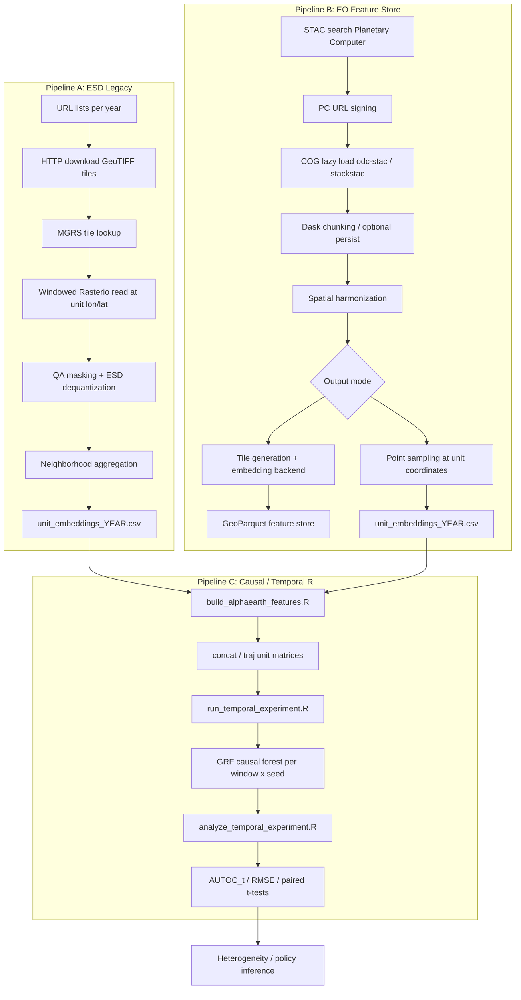
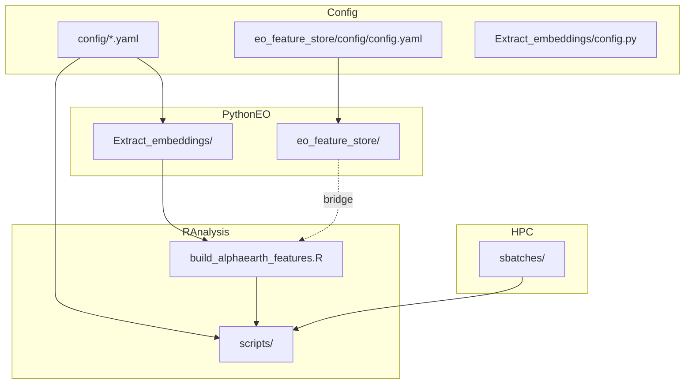
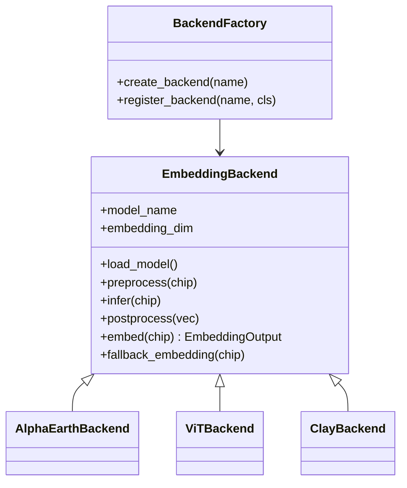
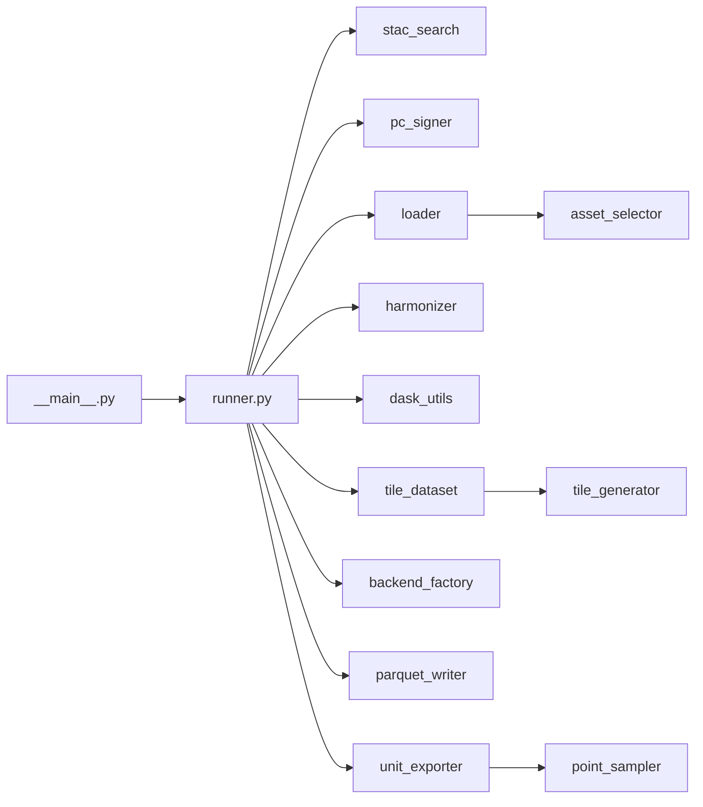
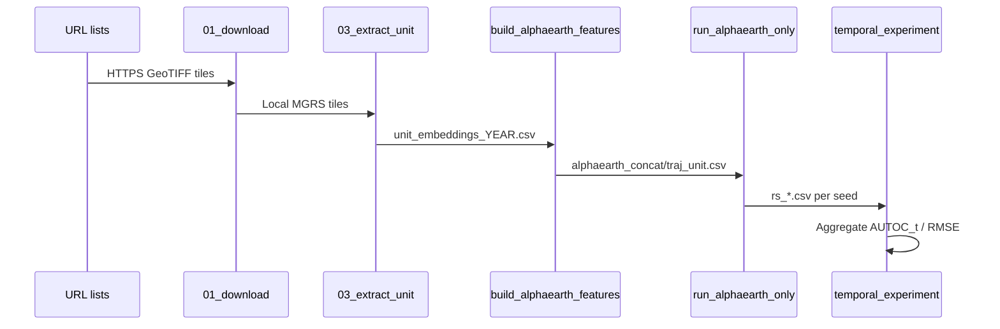

# Master Portfolio: Earth Observation Engineering Knowledge Base

**Repository:** `Imageseq` (also referenced as `CausalImages` in HPC job scripts)  
**Document role:** Single source of truth for EO pipeline engineering decisions, implementations, and demonstrated competencies.  
**Audience:** Future AI agents, architects, interview preparation systems — not end users.  
**Last reconstructed from repository:** 2026-07-07

---

## Table of Contents

1. [Executive Summary](#1-executive-summary)
2. [Repository Audit](#2-repository-audit)
3. [Reconstructed Pipeline Architecture](#3-reconstructed-pipeline-architecture)
4. [Pipeline Stage Reference](#4-pipeline-stage-reference)
5. [Earth Observation Datasets](#5-earth-observation-datasets)
6. [Geospatial Operations Catalog](#6-geospatial-operations-catalog)
7. [Performance Engineering](#7-performance-engineering)
8. [Embedding Architecture](#8-embedding-architecture)
9. [Software Engineering](#9-software-engineering)
10. [Engineering Decisions](#10-engineering-decisions)
11. [Technical Competency Extraction](#11-technical-competency-extraction)
12. [Resume Evidence Matrix](#12-resume-evidence-matrix)
13. [Keyword Matrix](#13-keyword-matrix)
14. [STAR Stories](#14-star-stories)
15. [Architecture Diagrams](#15-architecture-diagrams)
16. [Unknowns and Evidence Gaps](#16-unknowns-and-evidence-gaps)

---

## 1. Executive Summary

This repository implements **two related but architecturally distinct Earth Observation pipelines** that feed a **causal inference / heterogeneous treatment effect (HTE) analysis layer** in R.

### Pipeline A — Legacy ESD Unit Embedding Pipeline (Production path for RCT studies)

Precomputed **Google Earth Satellite Dataset (ESD)** embeddings stored as **MGRS-tiled GeoTIFFs** are downloaded, window-read at unit coordinates, dequantized to 72-dimensional vectors, aggregated over neighborhoods, and converted into temporal feature matrices (`concat`, `traj`) for **Generalized Random Forest (GRF)** causal forests.

**Primary evidence:** `Extract_embeddings/`, `config/Uganda.yaml`, `config/Georgia.yaml`, `scripts/`

### Pipeline B — Modular EO Feature Store (New cloud-native path)

**Landsat Collection 2 Level-2** imagery is discovered via **STAC** on **Microsoft Planetary Computer**, accessed as **Cloud Optimized GeoTIFFs (COGs)** on Azure Blob Storage, loaded lazily into **Xarray** via **odc-stac** (primary) or **stackstac**, optionally processed with **Dask**, harmonized, tiled or point-sampled, passed through a **pluggable embedding backend**, and written to **GeoParquet**. A downstream bridge exports legacy-compatible `unit_embeddings_<year>.csv` files.

**Primary evidence:** `eo_feature_store/`

### Pipeline C — Downstream Causal / Temporal Analysis (R)

Unit-level embedding features are temporally aggregated and evaluated across expanding pretreatment year windows using **GRF** (`grf` R package), with HPC orchestration via **SLURM array jobs**.

**Primary evidence:** `scripts/run_pipeline.R`, `scripts/run_temporal_experiment.R`, `Extract_embeddings/build_alphaearth_features.R`

---

## 2. Repository Audit

### 2.1 Present Top-Level Structure

```
Imageseq/
├── eo_feature_store/          # Modular cloud-native EO feature store (Python)
├── Extract_embeddings/        # Legacy ESD download + unit extraction (Python + R)
├── scripts/                   # R orchestration: temporal experiment, causal forest, analysis
├── config/                    # Per-RCT YAML configuration (Uganda, Georgia, template)
├── sbatches/                  # SLURM job definitions for HPC
├── data/                      # RCT unit CSVs, embeddings, features (gitignored)
├── results/                   # Experiment outputs (gitignored)
├── docs/                      # Legacy analysis R scripts (gitignored)
├── architecture.md            # High-level feature-store architecture note
├── PIPELINE.md                # User-facing temporal experiment guide
├── requirements.txt           # Python dependencies
└── master_portfolio_eo.md     # This document
```

### 2.2 Paths Referenced in Brief but NOT Present

| Path | Status | Notes |
|------|--------|-------|
| `Preparation-copy/` | **Absent** | No directory or references in codebase |
| `Embeddings/` | **Absent** | Functionality lives in `Extract_embeddings/` |
| `Analysis/` | **Absent** | Analysis logic in `scripts/` and `docs/` |
| `infra/` | **Absent** | HPC config only in `sbatches/` |
| `notebooks/` | **Absent** | No Jupyter notebooks found |
| `tests/` (repo root) | **Absent** | Tests only under `eo_feature_store/tests/` |

### 2.3 Language and Runtime Split

| Layer | Languages | Entry Points |
|-------|-----------|--------------|
| EO acquisition + raster IO | Python 3.10+ | `Extract_embeddings/run_embedding_pipeline.py`, `eo_feature_store/pipeline/__main__.py` |
| Feature engineering | R | `Extract_embeddings/build_alphaearth_features.R` |
| Causal inference | R (`grf`) | `scripts/run_alphaearth_only.R` |
| Orchestration | R + Bash (SLURM) | `scripts/run_pipeline.R`, `sbatches/*.sbatch` |

### 2.4 Configuration Surfaces

| Config File | Purpose |
|-------------|---------|
| `config/Uganda.yaml` | Uganda RCT: years 2000–2007, multiscale neighborhoods [3,17,33,167] |
| `config/Georgia.yaml` | Georgia RCT: years 2000–2006, neighborhoods [3,5] |
| `config/template.yaml` | Template for new RCTs |
| `Extract_embeddings/config.py` | Hardcoded Uganda ESD paths and constants |
| `eo_feature_store/config/config.yaml` | STAC, loader, Dask, tiling, embedding, unit sampling |

---

## 3. Reconstructed Pipeline Architecture

### 3.1 End-to-End System (Both EO Paths Converging to Causal Analysis)



### 3.2 Actual Workflow Order (Legacy — Verified in Code)

```
Historical ESD Archive (precomputed embeddings in GeoTIFF)
  ↓
Per-year URL file lists (Uganda{year}url.txt)
  ↓
HTTP download → embedding_images/{year}/*.tif
  ↓
MGRS tile resolution from unit lat/lon (mgrs library)
  ↓
Windowed Rasterio read (neighborhood around pixel)
  ↓
QA band thresholding (band 13, eo:cloud_cover analog)
  ↓
Product-quantization inverse (uint16 → 6D × 12 months = 72D)
  ↓
Neighborhood mean/median aggregation
  ↓
L2 normalization
  ↓
unit_embeddings_{year}.csv (per unit × year)
  ↓
build_alphaearth_features.R (concat + traj designs)
  ↓
run_alphaearth_only.R (GRF causal forest)
  ↓
Temporal window experiment + statistical analysis
```

### 3.3 Actual Workflow Order (Feature Store — Verified in Code)

```
Microsoft Planetary Computer STAC API
  ↓
landsat-c2-l2 collection search (bbox, datetime, cloud_cover, max_items)
  ↓
planetary_computer.sign() for SAS token COG access
  ↓
odc.stac.load() → lazy Xarray Dataset (bands: red, green, blue, nir08, swir16, swir22)
  ↓
Dask chunks (time:1, x:1024, y:1024) + optional LocalCluster persist
  ↓
harmonize() — CRS reprojection via rioxarray when .rio available
  ↓
Branch A: TileGenerator → chip extraction → EmbeddingBackend.embed()
Branch B: point_sampler.extract_point_chip() → EmbeddingBackend.embed()
  ↓
write_geoparquet() OR export_unit_embeddings_from_dataset()
  ↓
(Legacy bridge) unit_embeddings_{year}.csv → build_alphaearth_features.R
```

---

## 4. Pipeline Stage Reference

### Stage 1 — Data Discovery / Acquisition

#### 1A. ESD Tile Download (Legacy)

| Attribute | Detail |
|-----------|--------|
| **Purpose** | Materialize annual ESD GeoTIFF tiles for Uganda/Georgia study areas |
| **Inputs** | `data/{RCT}_data/{RCT}_urls/{prefix}{year}url.txt` (one HTTPS URL per line) |
| **Outputs** | `Extract_embeddings/embedding_images/{year}/SDC30_EBD_V001_{MGRS}_{year}.tif` |
| **Formats** | Cloud GeoTIFF, 13 bands (12 monthly codes + QA) |
| **Libraries** | `requests`, `rasterio` (validation) |
| **Key functions** | `01_download_esd_tiles.py`: `extract_filename_and_year()`, `is_valid_tif()`, download with retries |
| **Config** | `--year`, `--urls-dir`, `--url-prefix` via `run_embedding_pipeline.py` |
| **Performance** | Streaming download with 8KB chunks; validates by reading last pixel block to detect truncation |
| **Memory** | Full tile ~337 MB per file (noted in `03_extract_unit_embeddings.py` docstring) |
| **Tradeoff** | Downloads entire tiles though only small windows needed at extraction — simplifies IO at cost of storage |
| **Evidence** | `Extract_embeddings/01_download_esd_tiles.py`, `run_embedding_pipeline.py` (deletes tiles after year unless `--keep-tiles`) |

#### 1B. STAC Search (Feature Store)

| Attribute | Detail |
|-----------|--------|
| **Purpose** | Query spatiotemporal catalog for Landsat C2 L2 scenes |
| **Inputs** | `bbox`, `datetime` range, `collections`, `cloud_cover_max`, `max_items` |
| **Outputs** | STAC ItemCollection dict (`features` list) |
| **CRS** | Query in WGS84 (EPSG:4326) bbox |
| **Libraries** | `pystac-client`, `pystac` |
| **Key functions** | `search_stac()`, `search_landsat()` in `stac_search.py` |
| **Config** | `eo_feature_store/config/config.yaml` → `stac:` block |
| **Algorithm** | STAC API search with `eo:cloud_cover lte N` query filter |
| **Tradeoff** | Metadata-level cloud filter only — no per-pixel cloud mask in feature store path |
| **Evidence** | `eo_feature_store/acquisition/stac_search.py` |

#### 1C. Planetary Computer Signing

| Attribute | Detail |
|-----------|--------|
| **Purpose** | Obtain time-limited SAS URLs for Azure-hosted COGs |
| **Inputs** | Unsigned STAC Items |
| **Outputs** | Signed STAC Items with accessible `href`s |
| **Libraries** | `planetary_computer`, `pystac` |
| **Key functions** | `sign_item_collection()` in `pc_signer.py` |
| **Evidence** | `eo_feature_store/acquisition/pc_signer.py`, called in `pipeline/runner.py` |

---

### Stage 2 — Raster Loading

#### 2A. Windowed ESD Read (Legacy)

| Attribute | Detail |
|-----------|--------|
| **Purpose** | Read only the neighborhood around each unit coordinate |
| **Inputs** | Open GeoTIFF via cached `TileReader`, unit `(lon, lat)` in EPSG:4326 |
| **Outputs** | `(bands, h, w)` numpy array for neighborhood window |
| **CRS** | Reproject lon/lat to tile CRS via `rasterio.warp.transform` before `rowcol()` |
| **Libraries** | `rasterio` (Window, rowcol, xy, warp_transform), `mgrs` |
| **Key functions** | `lonlat_to_tile_xy()`, `window_clamped()`, `extract_unit()` in `03_extract_unit_embeddings.py` |
| **Config** | `--neighborhood`, `--qa-threshold`, `--agg` |
| **Performance** | **Windowed IO** — does not load full 337 MB tile into memory for each unit; `TileReader` caches open datasets |
| **QA** | Band index 12 (0-based); threshold from config (Uganda: 4, legacy config.py default: 5) |
| **Evidence** | `Extract_embeddings/03_extract_unit_embeddings.py` lines 140–257 |

#### 2B. Lazy COG Load (Feature Store)

| Attribute | Detail |
|-----------|--------|
| **Purpose** | Construct out-of-core Xarray Dataset from STAC items |
| **Inputs** | Signed STAC ItemCollection, `bbox`, `epsg`, `assets`/`bands`, `chunks` |
| **Outputs** | Lazy `xarray.Dataset` with dims `(time, y, x)` and band data vars |
| **CRS** | Output CRS set via `EPSG:{epsg}` (e.g., 32636 for Uganda UTM zone) |
| **Resolution** | 30 m (Landsat native) via `resolution=30` in odc-stac |
| **Libraries** | `odc.stac` (primary), `stackstac` (alternate), `xarray`, `rasterio` (fallback) |
| **Key functions** | `load_lazy_dataset()` in `preprocessing/loader.py` |
| **Config** | `remote_access.loader`, `remote_access.epsg`, `remote_access.chunks` |
| **Performance** | Dask-backed lazy arrays; only computes on `.compute()` or chip extraction |
| **Tradeoff** | **odc-stac chosen over stackstac** for Landsat C2 L2 on PC because per-asset CRS metadata is incomplete for stackstac without explicit `epsg=` — documented via runtime validation in development |
| **Evidence** | `loader.py`, `landsat_dataset.py`, `config.yaml` |

---

### Stage 3 — Distributed Processing

| Attribute | Detail |
|-----------|--------|
| **Purpose** | Enable parallel / out-of-core raster operations |
| **Libraries** | `dask`, `dask.distributed` |
| **Key functions** | `dask_client()` context manager, `persist_dataset()` in `dask_utils.py` |
| **Config** | `dask.enabled`, `dask.scheduler` (`threads` default, `distributed` optional), `n_workers`, `memory_limit` |
| **Chunking** | `time:1, band:1, x:1024, y:1024` in config |
| **Current usage** | Chunking always applied; `LocalCluster` only when `scheduler: distributed` |
| **Normalization decision** | Full-dataset normalization removed — triggers full compute and fails on large lazy arrays; **per-chip normalization** instead |
| **Evidence** | `eo_feature_store/preprocessing/dask_utils.py`, `pipeline/runner.py` |

---

### Stage 4 — Spatial Harmonization

| Attribute | Detail |
|-----------|--------|
| **Purpose** | Align imagery to target CRS and prepare for spatial operations |
| **Functions** | `harmonize()`, `reproject()`, `align()`, `clip()`, `mask()`, `mosaic()`, `normalize()`, `stack()` |
| **Libraries** | `rioxarray` (when `.rio` extension present), `xarray` |
| **Config** | `preprocessing.target_crs` (EPSG:4326), `preprocessing.resampling` (bilinear) |
| **Implemented vs wired** | Full harmonizer API exists; pipeline runner only calls `harmonize()` → `reproject()`. Mosaic/align/clip not wired in runner |
| **Limitation** | odc-stac Datasets may not expose top-level `.rio` — reprojection may no-op without explicit CRS assignment |
| **Evidence** | `eo_feature_store/preprocessing/harmonizer.py`, `reprojection.py`, `mosaicker.py` |

---

### Stage 5 — Quality Control / Masking

#### Legacy ESD QA (Implemented)

| Step | Implementation |
|------|----------------|
| QA band read | Band index 12 (`QA_BAND_INDEX`) |
| Threshold | `qa >= qa_threshold` (configurable per RCT) |
| Valid pixel mask | QA pass AND all monthly codes ≥ 0 AND not nodata |
| Status codes | `ok`, `low_quality`, `outside_tile_bounds`, `missing_tile`, `non_finite`, `zero_vector` |
| **Evidence** | `03_extract_unit_embeddings.py` lines 206–257 |

#### Feature Store QA (Partial)

| Step | Implementation |
|------|----------------|
| Scene-level cloud | STAC `eo:cloud_cover lte N` at search time |
| Pixel-level cloud mask | **Not implemented** in feature store path |
| Point status | `outside_bounds`, `empty_window`, `ok` in `point_sampler.py` |
| **Evidence** | `stac_search.py`, `point_sampler.py` |

---

### Stage 6 — Embedding Extraction

#### 6A. ESD Dequantization (Legacy)

| Attribute | Detail |
|-----------|--------|
| **Purpose** | Invert product quantization: uint16 monthly codes → 6D continuous vectors |
| **Algorithm** | Flat index decomposition via basis `[1, 8, 64, 512, 2560, 12800]` for levels `[8,8,8,5,5,5]`; scale to [-1,1] |
| **Output dim** | 12 months × 6 channels = **72 dimensions** |
| **Libraries** | NumPy (default), optional PyTorch |
| **Key classes** | `Quantizer` in `esd_quantizer.py` |
| **Reference** | Google `earth-data-tools` (noted in file header) |
| **Evidence** | `Extract_embeddings/esd_quantizer.py` |

#### 6B. Pluggable Embedding Backends (Feature Store)

| Attribute | Detail |
|-----------|--------|
| **Purpose** | Abstract inference behind a common `embed()` interface |
| **Interface** | `EmbeddingBackend`: `load_model()`, `preprocess()`, `infer()`, `postprocess()`, `embed()` |
| **Registered backends** | `alphaearth`, `vit`, `clay` via `backend_factory.py` |
| **Current inference** | **Fallback mode** unless callable `model` injected — deterministic stats-based vector normalized to L2 unit length |
| **Output dim** | Configurable (`embedding_dim: 768` default for feature store; 72 for legacy compatibility) |
| **Evidence** | `eo_feature_store/embeddings/` |

---

### Stage 7 — Spatial Aggregation Strategies

| Strategy | Pipeline | Implementation |
|----------|----------|----------------|
| Neighborhood mean | Legacy ESD | `sel.mean(axis=0)` over valid pixels in window |
| Neighborhood median | Legacy ESD | `np.median(sel, axis=0)` |
| Multiscale neighborhoods | Legacy | Config `neighborhoods: [3, 17, 33, 167]` → output dirs `nb{NNN}/` |
| Tile-based embedding | Feature store | `TileGenerator` sliding windows over raster extent |
| Point + neighborhood | Feature store | `extract_point_chip()` with `neighborhood_pixels` and spectral aggregation before embed |
| **Evidence** | `03_extract_unit_embeddings.py`, `tile_generator.py`, `point_sampler.py` |

---

### Stage 8 — Feature Store / Serialization

#### GeoParquet (Feature Store)

| Column | Type | Purpose |
|--------|------|---------|
| `geometry` | Shapely / WKB | Tile footprint (when georeferencing available) |
| `crs` | string | Dataset CRS |
| `timestamp` | datetime | Scene acquisition time |
| `tile_id` | string | Unique tile identifier |
| `scene_id` | string | STAC scene ID |
| `embedding` | list[float] | Embedding vector |
| `embedding_dim` | int | Vector length |
| `model_name`, `model_version` | string | Provenance |
| `band_info`, `processing_params`, `quality_metrics` | JSON string | Serialized metadata |
| **Writer** | `write_geoparquet()` — GeoPandas when available, PyArrow fallback |
| **Evidence** | `feature_store/schema.py`, `parquet_writer.py`, `metadata.py` |

#### Unit Embedding CSV (Legacy interchange format)

| Column | Purpose |
|--------|---------|
| `unit_id` | RCT unit identifier |
| `year` | Pretreatment year |
| `status` | `ok`, `low_quality`, `missing_tile`, etc. |
| `band_0` … `band_71` | 72-dim embedding (L2-normalized when ok) |
| `pixel_row`, `pixel_col`, `offset_m` | QA fields (feature store point export adds these) |
| **Evidence** | `build_alphaearth_features.R` expects `band_0..71`, `03_extract_unit_embeddings.py` output |

---

### Stage 9 — Temporal Feature Engineering (R)

| Attribute | Detail |
|-----------|--------|
| **Purpose** | Convert per-year 72-dim embeddings into unit-level design matrices |
| **Designs** | **concat**: horizontal stack of year blocks with mask columns; **traj**: trajectory statistics (mean vector, displacement, path length, consecutive cosine similarity) |
| **Imputation** | Unit mean for missing years; cross-unit mean for units with zero valid years |
| **Key script** | `Extract_embeddings/build_alphaearth_features.R` |
| **Outputs** | `alphaearth_concat{_tag}_unit.csv`, `alphaearth_traj{_tag}_unit.csv`, manifest CSV |
| **Evidence** | `build_alphaearth_features.R` lines 138–238 |

---

### Stage 10 — Causal Forest / HTE Estimation (R)

| Attribute | Detail |
|-----------|--------|
| **Purpose** | Estimate conditional average treatment effects using satellite embeddings as covariates |
| **Model** | `grf::causal_forest` with unit clustering |
| **Metrics** | AUTOC_t (rank-weighted ATE autocorrelation), AUTOCQ_t, RMSE via regression forest, variable importance |
| **Monte Carlo** | 25 seeds default (Uganda/Georgia config) |
| **Hyperparams** | `num.trees=2000`, `min.node.size=5` |
| **Key script** | `scripts/run_alphaearth_only.R` |
| **Evidence** | `run_alphaearth_only.R`, `config/Uganda.yaml` `temporal_experiment` block |

---

### Stage 11 — Temporal Window Experiment

| Attribute | Detail |
|-----------|--------|
| **Purpose** | Determine how many pretreatment years of embedding history improve HTE detectability |
| **Windows** | Expanding windows anchored at `anchor_year`, growing backward to `earliest_year` |
| **Orchestration** | `run_temporal_experiment.R` builds features per window, runs GRF per seed |
| **HPC** | `sbatches/run_temporal_array.sbatch` — SLURM array 0–7, one window per task |
| **Aggregation** | `run_temporal_aggregate.sbatch`, `aggregate_results.R` |
| **Analysis** | `analyze_temporal_experiment.R` — PDF plots, paired t-tests vs full window |
| **Evidence** | `scripts/run_temporal_experiment.R`, `sbatches/`, `PIPELINE.md` |

---

## 5. Earth Observation Datasets

### 5.1 Google Earth Satellite Dataset (ESD) — Legacy Primary

| Property | Value |
|----------|-------|
| **Source** | Google Research Earth Satellite Dataset (precomputed embeddings) |
| **Reference** | `https://github.com/google-research/earth-data-tools` (cited in `esd_quantizer.py`) |
| **Spatial resolution** | 30 m (`ESD_PIXEL_SIZE_M = 30`) |
| **Temporal resolution** | Annual composite; 12 monthly sub-bands per year |
| **Tiling** | MGRS 5-character tiles, 3600×3600 pixels (~108 km) |
| **CRS** | Per-tile (reprojected at read time; unit coords in EPSG:4326) |
| **Bands** | 12 data bands (monthly quantized codes) + 1 QA band = 13 total |
| **Storage** | GeoTIFF (local after download) |
| **Download** | HTTPS URL lists per year — not STAC |
| **Preprocessing** | Product quantization → dequantized 6D vectors per month |
| **Embedding dim** | 72 (12 × 6) |
| **Role** | Primary pretreatment covariates for Uganda (2000–2007) and Georgia (2000–2006) RCTs |
| **Evidence** | `Extract_embeddings/config.py`, `01_download_esd_tiles.py` |

### 5.2 Landsat Collection 2 Level-2 — Feature Store

| Property | Value |
|----------|-------|
| **Source** | Microsoft Planetary Computer STAC → Azure Blob (`landsateuwest.blob.core.windows.net`) |
| **Collection ID** | `landsat-c2-l2` (verified; `landsat-c2l2-sr` returns zero items on PC) |
| **Spatial resolution** | 30 m (`resolution=30` in odc-stac loader) |
| **Temporal resolution** | Per-scene (not composited in pipeline) |
| **CRS** | UTM per path/row; pipeline requests output `EPSG:32636` (configurable) |
| **Bands used** | `red`, `green`, `blue`, `nir08`, `swir16`, `swir22` |
| **Storage** | COG on Azure (remote); lazy access |
| **Download** | No full download — range reads via COG |
| **Cloud handling** | STAC metadata `eo:cloud_cover` filter only |
| **Role** | Scalable alternative path; not yet production-default for RCT experiments |
| **Evidence** | `eo_feature_store/config/config.yaml`, `loader.py`, `stac_search.py` |

### 5.3 RCT Outcome / Treatment Data (Non-EO)

| Dataset | Location | Role |
|---------|----------|------|
| Uganda unit locations | `data/Uganda_data/Uganda_unit_locations.csv` | `geo_long`, `geo_lat`, `geo_long_lat_key` |
| Uganda outcomes | `data/Uganda_data/UgandaDataProcessed_clean.csv` | `Yobs`, `Wobs` |
| Georgia unit locations | `data/Georgia_data/Georgia_unit_locations.csv` | `sf1_b_geoid1_key` |
| Georgia outcomes | `data/Georgia_data/GeorgiaDataProcessed_clean.csv` | `Yobs`, `Wobs` |

---

## 6. Geospatial Operations Catalog

Only operations with code evidence are listed.

| Operation | Pipeline | Implementation | File(s) |
|-----------|----------|----------------|---------|
| STAC catalog search | B | `pystac_client.Client.search()` | `stac_search.py` |
| STAC item signing | B | `planetary_computer.sign()` | `pc_signer.py` |
| STAC asset selection | B | `select_assets()` by name, role, band | `asset_selector.py` |
| COG lazy load | B | `odc.stac.load()`, `stackstac.stack()` | `loader.py` |
| HTTP GeoTIFF download | A | `requests` streaming | `01_download_esd_tiles.py` |
| GeoTIFF validation | A | Header + last-block read | `01_download_esd_tiles.py:is_valid_tif()` |
| MGRS tile lookup | A | `mgrs.MGRS().toMGRS()` | `03_extract_unit_embeddings.py` |
| CRS reprojection (point) | A, B | `rasterio.warp.transform` | `03_extract_unit_embeddings.py`, `point_sampler.py` |
| Pixel index from coords | A, B | `rasterio.transform.rowcol` | `03_extract_unit_embeddings.py`, `point_sampler.py` |
| Windowed raster read | A | `rasterio.windows.Window` | `03_extract_unit_embeddings.py` |
| Lazy xarray isel (chip) | B | `dataset.isel({y, x})` | `runner.py`, `point_sampler.py` |
| Chunked Dask arrays | B | `chunks` in loader + xarray | `loader.py`, `config.yaml` |
| CRS reprojection (raster) | B | `dataset.rio.reproject()` | `harmonizer.py` |
| Raster mosaicking | B | `combine_first` loop | `harmonizer.py:mosaic()` |
| Alignment | B | `reproject_match` | `harmonizer.py:align()` |
| Clipping | B | `rio.clip` | `harmonizer.py:clip()` |
| Masking | B | `dataset.where` | `harmonizer.py:mask()` |
| L2 / zscore / minmax normalization | B | `normalize_array()` | `normalization.py` |
| Tile window generation | B | Nested row/col loops | `tile_generator.py` |
| Temporal tile iteration | B | Per `time` index slice | `tile_dataset.py` |
| Point neighborhood aggregation | A, B | `nanmean` / `nanmedian` | `03_extract_unit_embeddings.py`, `point_sampler.py` |
| Haversine offset QA | A, B | Great-circle distance | `03_extract_unit_embeddings.py`, `point_sampler.py` |
| GeoParquet write | B | `geopandas.to_parquet` / PyArrow | `parquet_writer.py` |
| Product quantization inverse | A | `Quantizer.indices_to_codes()` | `esd_quantizer.py` |

### Not Implemented (despite harmonizer API surface)

- Per-pixel Landsat cloud masking (e.g., `qa_pixel` band)
- Temporal compositing / mosaicking across scenes in feature store runner
- S3 direct access path (s3fs wired in `downloader.py` but not used in main pipeline)
- Automatic UTM zone detection from bbox centroid

---

## 7. Performance Engineering

| Technique | Where | Evidence |
|-----------|-------|----------|
| **Windowed IO** | Legacy extraction | Read `(bands, h, w)` windows not full tiles — `03_extract_unit_embeddings.py` |
| **Dataset caching** | Legacy | `TileReader` caches open rasterio handles |
| **Tile deletion after year** | Legacy | `delete_year_tiles()` frees disk — `run_embedding_pipeline.py` |
| **COG lazy / range reads** | Feature store | `odc-stac` + Dask chunks — no full scene download |
| **Dask chunking** | Feature store | `x:1024, y:1024, time:1` — `config.yaml` |
| **Lazy evaluation** | Feature store | Xarray/Dask; compute only on chip `.compute()` |
| **Per-chip normalization** | Feature store | Avoids materializing full raster — `runner.py` design decision |
| **Optional Dask distributed** | Feature store | `LocalCluster` via `dask_client()` |
| **STAC result limiting** | Feature store | `max_items: 3` prevents stacking entire catalog |
| **SLURM array parallelism** | Downstream R | 8 windows in parallel — `run_temporal_array.sbatch` |
| **Skip-if-exists** | Legacy | Skip extraction if `unit_embeddings_{year}.csv` exists |
| **Batch inference** | Feature store | `TileGenerator.batch()` exists but not used in runner |
| **GPU inference** | Optional | PyTorch path in `esd_quantizer.py`; not default |

### Memory Considerations

| Risk | Mitigation in code |
|------|-------------------|
| Full tile in memory | Windowed reads (legacy) |
| Full scene compute | Lazy Dask + chip-level compute only |
| Disk exhaustion from tiles | Per-year tile deletion |
| Empty stackstac load | Validation `_validate_dataset()` + odc-stac default |

---

## 8. Embedding Architecture

### 8.1 Why Modular Backends

The feature store treats embedding models as **replaceable inference plugins** rather than hardcoded pipeline stages. This separates:

1. **Raster geometry** (acquisition, loading, sampling)
2. **Model inference** (AlphaEarth, ViT, Clay, future models)
3. **Storage schema** (GeoParquet with model provenance columns)

**Evidence:** `EmbeddingBackend` ABC, `backend_factory.py`, `runner.py` calls `create_backend()` independently of loader.

### 8.2 Backend Interface Contract

```python
class EmbeddingBackend(ABC):
    def load_model(**kwargs) -> Any
    def preprocess(chip, **kwargs) -> Any
    def infer(chip, **kwargs) -> np.ndarray
    def postprocess(embedding, **kwargs) -> np.ndarray
    def embed(chip, **kwargs) -> EmbeddingOutput
    def fallback_embedding(chip) -> np.ndarray  # smoke-test / no-weights path
```

**File:** `eo_feature_store/embeddings/base_backend.py`

### 8.3 Registered Models

| Name | Class | Current behavior |
|------|-------|------------------|
| `alphaearth` | `AlphaEarthBackend` | Callable model or fallback stats embedding |
| `vit` | `ViTBackend` | Callable model or fallback |
| `clay` | `ClayBackend` | Callable model or fallback |

### 8.4 How AlphaEarth Changed Architecture

**Before (Legacy only):** "AlphaEarth" referred to **Google ESD precomputed embeddings** — not a live model. Extraction was dequantization of stored codes, not neural inference. The name `alphaearth` in R scripts (`build_alphaearth_features.R`, `run_alphaearth_only.R`) reflects this historical naming.

**After (Feature store):** `AlphaEarthBackend` introduces a **runtime inference slot** for foundation model embeddings over freshly read Landsat chips, with:
- Configurable `embedding_dim` (768 vs legacy 72)
- GeoParquet provenance (`model_name`, `model_version`)
- Bridge export to legacy 72-band CSV format for downstream R compatibility

**Architectural implication:** The repository now supports **dual semantics of "AlphaEarth"** — precomputed ESD vectors (legacy) vs pluggable model backend (feature store). Downstream R pipeline remains unchanged because `export_unit_embeddings_from_dataset()` writes `band_*` columns.

### 8.5 Shared Preprocessing / Outputs

| Concern | Shared module |
|---------|---------------|
| Chip normalization | `preprocessing/normalization.py` |
| Chip extraction (tiles) | `runner._extract_chip()` |
| Chip extraction (points) | `point_sampler.extract_point_chip()` |
| Output schema | `feature_store/schema.py` |
| Metadata | `FeatureMetadata` dataclass |

### 8.6 Future Extensibility

1. Register new backend in `backend_factory._REGISTRY`
2. Subclass `EmbeddingBackend`
3. Inject trained weights via `model=` kwarg to `create_backend()`
4. No changes required to STAC loader or GeoParquet writer

---

## 9. Software Engineering

### 9.1 Module Responsibility Graph

```
eo_feature_store/
├── acquisition/     STAC search, PC signing, asset selection, optional HTTP/S3 download
├── datasets/        LandsatDataset wrapper, TileDataset iterator
├── preprocessing/   Lazy load, harmonize, normalize, Dask utils
├── tiling/          TileWindow generation
├── embeddings/      Backend ABC + factory + model adapters
├── feature_store/   Schema, metadata, GeoParquet writer
├── downstream/      Point sampler, unit CSV exporter
├── pipeline/        Config loading, orchestration, CLI
└── tests/           Smoke tests (mock datasets, no network)
```

### 9.2 Dependency Graph (Python)

```
pipeline/runner.py
  → acquisition (stac_search, pc_signer)
  → datasets (landsat_dataset, tile_dataset)
  → preprocessing (harmonizer, dask_utils, loader)
  → embeddings (backend_factory)
  → feature_store (parquet_writer, metadata)
  → downstream (unit_exporter → point_sampler)
```

### 9.3 Configuration Management

| System | Mechanism |
|--------|-----------|
| RCT experiments | YAML per project → `load_config.R` exports `CONFIG_*` globals |
| Python embedding pipeline | Reads same YAML via PyYAML or R fallback JSON |
| Feature store | Separate `eo_feature_store/config/config.yaml` |
| HPC | Environment variables + CLI args in sbatch (`PROJECT_ROOT`, `CONDA_ENV`) |

### 9.4 Pipeline Orchestration

| Entry point | Role |
|-------------|------|
| `run_embedding_pipeline.py` | Legacy: download → extract → optional feature build |
| `eo_feature_store.pipeline.__main__` | Feature store CLI |
| `scripts/run_pipeline.R` | Master R orchestrator |
| `run_temporal_experiment.R` | Window sweep driver |

### 9.5 Logging

| Location | Style |
|----------|-------|
| `Extract_embeddings/config.py:setup_logging()` | `[LEVEL] timestamp - message` to stderr |
| `run_embedding_pipeline.py` | Python `logging` module |
| R scripts | `cat(sprintf(...))` info lines |

### 9.6 Testing

| Test file | Coverage |
|-----------|----------|
| `eo_feature_store/tests/test_pipeline_smoke.py` | Config load, backend embed, tile/chip extraction, GeoParquet write, point sampling (mocked geobox) |

**Gaps:** No integration tests with network STAC; no R test suite; no legacy Python unit tests.

### 9.7 Error Handling Patterns

- Explicit `status` field per unit-year row (legacy) rather than exceptions
- `ValueError` with actionable messages for empty STAC / empty spatial extent (feature store)
- `RuntimeError` on subprocess failure in `run_embedding_pipeline.py`
- Optional imports with clear dependency errors (`pystac-client required`)

### 9.8 Reproducibility

- Monte Carlo seeds: `set.seed(999L * monte_i)` in GRF
- Config-driven parameters exported to CSV outputs with `scheme`, `tag`, `monte` columns
- Manifest CSVs for feature builds
- **Gap:** No pinned conda `environment.yml` in repo; HPC uses `imageseq` conda env

---

## 10. Engineering Decisions

### Decision 1: Dual Pipeline Architecture (Legacy + Feature Store)

| | |
|--|--|
| **Decision** | Add `eo_feature_store/` as standalone module without removing `Extract_embeddings/` |
| **Motivation** | Preserve working RCT reproducibility while enabling cloud-native Landsat path |
| **Alternatives** | Full migration (high risk); STAC-only greenfield (loses ESD path) |
| **Tradeoffs** | Two config systems; naming collision on "AlphaEarth" |
| **Future** | Converge on feature store for new RCTs once model weights wired |

### Decision 2: odc-stac over stackstac for Landsat C2 L2

| | |
|--|--|
| **Decision** | Default `remote_access.loader: odc-stac` |
| **Motivation** | PC Landsat assets lack per-asset `proj:epsg`; stackstac returned empty arrays |
| **Alternatives** | stackstac with manual `epsg=` (still produced 0×0 in testing) |
| **Tradeoffs** | odc-stac returns Dataset not DataArray; required `to_array(dim="variable")` in chip extraction |
| **Evidence** | Runtime debugging documented in development; `config.yaml`, `loader.py` |

### Decision 3: Point Sampling vs Nearest-Tile for Unit Export

| | |
|--|--|
| **Decision** | Replace GeoParquet nearest-tile lookup with `point_sampler.extract_point_chip()` |
| **Motivation** | Unit coordinates require sub-tile precision; nearest tile centroid is inaccurate |
| **Alternatives** | Point-in-polygon against tile geometries; post-hoc raster sample from saved COGs |
| **Tradeoffs** | Requires dataset in memory at export time; cannot re-export from Parquet alone |
| **Evidence** | `downstream/point_sampler.py`, `unit_exporter.py` |

### Decision 4: Per-Chip vs Full-Raster Normalization

| | |
|--|--|
| **Decision** | Normalize at chip extraction, not on full Dataset |
| **Motivation** | Full `.values` compute on Dask array fails / materializes entire scene |
| **Tradeoffs** | Normalization not globally consistent across full raster |
| **Evidence** | `runner.py` `_extract_chip(normalize_chip=...)` |

### Decision 5: Neighborhood Aggregation Before Embedding (Feature Store Points)

| | |
|--|--|
| **Decision** | Spectral mean/median over window, then single `backend.embed()` call |
| **Motivation** | Matches legacy ESD workflow semantics (aggregate dequantized vectors, then normalize) |
| **Alternatives** | Embed each pixel then average embedding vectors |
| **Tradeoffs** | Different from per-pixel embedding ensemble; consistent with legacy science |

### Decision 6: YAML as Cross-Language Config

| | |
|--|--|
| **Decision** | Single YAML read by both R (`yaml` package) and Python (`pyyaml`) |
| **Motivation** | One config per RCT drives extraction and causal experiments |
| **Alternatives** | Separate Python/R configs; JSON-only |
| **Evidence** | `load_config.R`, `run_embedding_pipeline.py:load_config()` |

### Decision 7: SLURM Array for Temporal Windows

| | |
|--|--|
| **Decision** | `SLURM_ARRAY_TASK_ID` maps to window start year |
| **Motivation** | Embarrassingly parallel windows (8+ years); 2–4 hour serial runtime |
| **Evidence** | `run_temporal_array.sbatch` lines 35–50 |

---

## 11. Technical Competency Extraction

### 11.1 STAC-Based EO Acquisition

**Level 1:** Earth Observation Data Acquisition  
**Level 2:** Built STAC search and signed COG access for Landsat on Planetary Computer.  
**Level 3:** Implemented `search_landsat()` with `pystac-client`, cloud cover query filters, `max_items` limits, and `planetary_computer.sign()` for Azure SAS token URL signing before lazy COG reads.

### 11.2 Cloud-Native Raster Loading

**Level 1:** Cloud-Native Geospatial Processing  
**Level 2:** Designed lazy Xarray loading from STAC ItemCollections without full raster download.  
**Level 3:** Wired `odc.stac.load()` with EPSG-projected output, 30 m resolution, bbox clipping, and Dask chunk maps (`time:1, x:1024, y:1024`) over Azure-hosted Landsat COGs.

### 11.3 Windowed Raster Extraction at Points

**Level 1:** Spatial Data Engineering  
**Level 2:** Built point-level unit sampling with CRS-aware pixel indexing and neighborhood aggregation.  
**Level 3:** Reprojected EPSG:4326 unit coordinates to dataset CRS via `rasterio.warp.transform`, computed `rowcol` indices, clamped windows to raster bounds, and aggregated valid spectra with configurable mean/median before embedding inference.

### 11.4 ESD Quantization Pipeline

**Level 1:** Remote Sensing Feature Extraction  
**Level 2:** Implemented inverse product quantization for precomputed satellite embedding GeoTIFFs.  
**Level 3:** Ported Google ESD `Quantizer` with basis decomposition `[8,8,8,5,5,5]` levels, QA-band masking, and L2-normalized 72-dimensional annual unit vectors from 12 monthly uint16 codes.

### 11.5 Pluggable ML Backend Architecture

**Level 1:** Software Architecture  
**Level 2:** Designed abstract embedding backend interface for EO foundation models.  
**Level 3:** Created `EmbeddingBackend` ABC with factory registration, deterministic fallback embeddings for CI/smoke testing, and provenance tracking in GeoParquet (`model_name`, `model_version`, `embedding_dim`).

### 11.6 GeoParquet Feature Store

**Level 1:** Geospatial Data Engineering  
**Level 2:** Implemented embedding feature store with geometry and model metadata.  
**Level 3:** Built `write_geoparquet()` with GeoPandas/Shapely geometry, JSON-serialized nested metadata, and schema enforcement via `FeatureStoreSchema` dataclass.

### 11.7 Temporal Representation Learning for Causal Inference

**Level 1:** Environmental Data Science  
**Level 2:** Engineered temporal concatenation and trajectory features from multi-year embedding sequences.  
**Level 3:** Authored `build_alphaearth_features.R` producing concat masks, chronological trajectory statistics (displacement, path length, consecutive cosine similarity), and imputation for missing years across RCT units.

### 11.8 Causal Forest HTE with Clustered Units

**Level 1:** Causal Inference / Heterogeneity Analysis  
**Level 2:** Ran generalized random forests with unit clustering on satellite embedding covariates.  
**Level 3:** Implemented `run_alphaearth_only.R` with `grf::causal_forest(clusters=units)`, AUTOC_t heterogeneity metric, 25-seed Monte Carlo, and variable importance extraction.

### 11.9 HPC Workflow Orchestration

**Level 1:** High-Performance Computing  
**Level 2:** Parallelized temporal pretreatment window experiments on SLURM.  
**Level 3:** Authored SLURM array batch scripts mapping `SLURM_ARRAY_TASK_ID` to anchor-relative year windows with dependency-chained aggregation jobs on shared HPC (`vm-small` partition, conda `imageseq` env).

### 11.10 Dask Distributed Raster Processing

**Level 1:** Distributed Computing  
**Level 2:** Integrated Dask with lazy Xarray EO datasets.  
**Level 3:** Implemented optional `LocalCluster` client context manager, `dataset.persist()` hook, and chunk-aware loading to defer computation until chip-level `.compute()`.

---

## 12. Resume Evidence Matrix

| Competency | Repository Evidence | Files | Key Functions | Strength | Resume Narratives |
|------------|---------------------|-------|---------------|----------|-------------------|
| STAC catalog search | PC Landsat STAC integration | `stac_search.py` | `search_landsat()` | ★★★★☆ | Geospatial Engineer, GIS Analyst, Climate Analyst |
| COG / cloud raster access | Signed COG lazy load | `pc_signer.py`, `loader.py` | `sign_item_collection()`, `load_lazy_dataset()` | ★★★★☆ | Geospatial Engineer, Cloud GIS |
| Lazy Xarray / Dask EO | Chunked lazy datasets | `loader.py`, `dask_utils.py` | `dask_client()`, `persist_dataset()` | ★★★★☆ | Geospatial Engineer, Data Engineer |
| Windowed raster IO | ESD unit extraction | `03_extract_unit_embeddings.py` | `extract_unit()`, `window_clamped()` | ★★★★★ | GIS Analyst, Geospatial Engineer |
| CRS reprojection | Point → pixel mapping | `03_extract_unit_embeddings.py`, `point_sampler.py` | `lonlat_to_tile_xy()`, `lonlat_to_rowcol()` | ★★★★★ | GIS Analyst, Surveying/GIS |
| MGRS tiling | Tile code from lat/lon | `03_extract_unit_embeddings.py`, `config.py` | `mgrs_tile_for()` | ★★★★☆ | GIS Analyst, Defense/EO |
| Product quantization / embeddings | ESD dequantization | `esd_quantizer.py` | `Quantizer.indices_to_codes()` | ★★★★★ | ML Engineer, Climate Analyst |
| QA masking | QA band threshold | `03_extract_unit_embeddings.py` | `extract_unit()` valid mask | ★★★★☆ | Remote Sensing Scientist |
| Neighborhood spatial aggregation | Multiscale windows | `03_extract_unit_embeddings.py`, `point_sampler.py` | aggregation in `extract_unit()` | ★★★★★ | Wildfire Analyst, Ecologist, GIS |
| GeoParquet feature store | Embedding storage | `parquet_writer.py`, `schema.py` | `write_geoparquet()` | ★★★★☆ | Geospatial Data Engineer |
| Pluggable ML backends | Foundation model interface | `base_backend.py`, `backend_factory.py` | `EmbeddingBackend.embed()` | ★★★★☆ | ML Engineer, Geospatial AI |
| Tile generation | Sliding windows | `tile_generator.py` | `TileGenerator.generate()` | ★★★★☆ | Computer Vision EO, GIS |
| Point-level unit sampling | Coordinate extraction | `point_sampler.py` | `extract_point_chip()` | ★★★★☆ | GIS Analyst, Geospatial Engineer |
| Temporal feature engineering | concat/traj designs | `build_alphaearth_features.R` | `year_matrix()`, trajectory loop | ★★★★★ | Data Scientist, Causal Analyst |
| Causal forest HTE | GRF with clustering | `run_alphaearth_only.R` | `causal_forest()`, `fit_one()` | ★★★★★ | Econometrician, Policy Analyst |
| Temporal experiment design | Expanding windows | `run_temporal_experiment.R` | `run_window()` | ★★★★★ | Research Scientist |
| SLURM HPC | Array jobs | `run_temporal_array.sbatch` | array 0–7 | ★★★★☆ | HPC Engineer, Research Computing |
| Config-driven pipelines | YAML RCT configs | `load_config.R`, `config/*.yaml` | `load_config()` | ★★★★☆ | Software Engineer, Reproducible Research |
| Spatial ETL orchestration | End-to-end Python driver | `run_embedding_pipeline.py` | `main()` | ★★★★★ | Geospatial Engineer, Pipeline Engineer |
| Raster harmonization API | Reproject/align/mosaic | `harmonizer.py` | `reproject()`, `mosaic()` | ★★★☆☆ | Remote Sensing (partially wired) |
| Band selection | Landsat SR bands | `asset_selector.py`, `config.yaml` | `select_assets()` | ★★★★☆ | Remote Sensing Scientist |

---

## 13. Keyword Matrix

```
Earth Observation
├── Remote Sensing
│   ├── Landsat Collection 2
│   │   ├── Surface Reflectance (SR)
│   │   ├── Band selection (red, green, blue, nir08, swir16, swir22)
│   │   └── Scene-level cloud cover filtering (STAC metadata)
│   ├── Google Earth Satellite Dataset (ESD)
│   │   ├── Product quantization
│   │   ├── MGRS tiling
│   │   └── QA band masking
│   └── Point sampling vs area aggregation
├── Spatial Data Processing
│   ├── Coordinate Reference Systems
│   │   ├── EPSG:4326 (WGS84)
│   │   ├── UTM (EPSG:32636)
│   │   └── Per-tile CRS (ESD)
│   ├── Raster Harmonization
│   │   ├── GDAL / rioxarray reprojection
│   │   ├── Bilinear resampling
│   │   └── Raster alignment (reproject_match)
│   ├── Windowed IO
│   │   ├── Rasterio Windows
│   │   ├── COG range reads
│   │   └── Xarray isel slicing
│   └── Vector / raster integration
│       ├── GeoParquet
│       └── Shapely geometries
├── Cloud-Native Geospatial
│   ├── STAC (SpatioTemporal Asset Catalog)
│   │   ├── pystac-client
│   │   └── Microsoft Planetary Computer
│   ├── Cloud Optimized GeoTIFF (COG)
│   │   ├── Azure Blob Storage
│   │   └── planetary_computer signing
│   └── odc-stac / stackstac
├── Distributed Computing
│   ├── Dask
│   │   ├── Chunked arrays
│   │   ├── Lazy evaluation
│   │   └── LocalCluster (optional)
│   └── SLURM
│       ├── Array jobs
│       └── Job dependencies
├── Foundation Models / Embeddings
│   ├── AlphaEarth (dual: ESD codes + backend slot)
│   ├── Vision Transformer (ViT backend stub)
│   ├── Clay backend stub
│   └── L2 normalization
├── Feature Store
│   ├── GeoParquet
│   ├── Embedding provenance metadata
│   └── Schema enforcement
├── Geospatial ETL
│   ├── YAML-driven orchestration
│   ├── Per-RCT data layouts
│   └── CSV / Parquet interchange
├── Causal Inference / Environmental Analysis
│   ├── Generalized Random Forest (grf)
│   ├── Heterogeneous treatment effects (HTE)
│   ├── AUTOC_t metric
│   └── Temporal pretreatment windows
└── Scientific Computing
    ├── NumPy / Pandas
    ├── Xarray
    ├── R statistical computing
    └── Monte Carlo reproducibility
```

---

## 14. STAR Stories

### STAR-1: Building a Config-Driven Multiscale EO Extraction Pipeline for RCTs

**Situation:** Multiple randomized controlled trials (Uganda, Georgia) required pretreatment satellite embedding covariates at different spatial scales for heterogeneity analysis, with different unit ID schemes and year coverage.

**Task:** Create a reusable extraction pipeline that downloads only required tiles, extracts unit-level embeddings, supports multiple neighborhood sizes, and feeds a causal forest framework — without per-study code forks.

**Actions:**
- Implemented `run_embedding_pipeline.py` reading per-RCT YAML shared with R (`config/Uganda.yaml`, `config/Georgia.yaml`)
- Built windowed raster extraction in `03_extract_unit_embeddings.py` with CRS-correct pixel lookup and QA masking
- Added multiscale output paths (`nb003/`, `nb167/`) and automatic tile cleanup to manage disk
- Connected extraction to `build_alphaearth_features.R` for concat/traj feature matrices

**Technical Decisions:** YAML cross-language config; neighborhood aggregation before L2 normalization; status-column error model instead of fail-fast per unit.

**Result:** Single command produces embeddings and features for any configured RCT; Uganda runs neighborhoods up to 167 px (~5 km); pipeline documented in `PIPELINE.md`.

**Lessons Learned:** Coordinate precision varies across units — neighborhood reads are essential; MGRS tile caching amortizes open-file cost across units.

---

### STAR-2: Migrating from Precomputed Embeddings to Cloud-Native Landsat STAC Pipeline

**Situation:** Legacy pipeline depended on precomputed ESD GeoTIFFs via static URL lists, limiting sensor choice, temporal flexibility, and scalability.

**Task:** Design a modular EO feature store supporting STAC discovery, lazy COG access, distributed processing, and pluggable embedding backends — without breaking the existing R causal inference downstream.

**Actions:**
- Created `eo_feature_store/` package with separated acquisition, preprocessing, tiling, embedding, and storage modules
- Implemented STAC search + Planetary Computer signing + `odc-stac` lazy loading
- Discovered and fixed Landsat collection naming (`landsat-c2-l2`) and loader incompatibility (stackstac vs odc-stac)
- Built GeoParquet writer with provenance schema and point-level `point_sampler` bridge to legacy CSV format

**Technical Decisions:** Standalone package coexisting with legacy; per-chip compute; odc-stac default; fallback embeddings for smoke testing without GPU weights.

**Result:** End-to-end smoke test writes `alphaearth_features.parquet` and `unit_embeddings_{year}.csv` from real Landsat COGs; 5 Python smoke tests pass.

**Lessons Learned:** STAC asset metadata heterogeneity across collections requires loader validation; never normalize full lazy Dask arrays in EO pipelines.

---

### STAR-3: Quantifying Pretreatment History Value for Heterogeneous Treatment Effect Detection

**Situation:** Research question: how many years of pretreatment satellite embedding history improve detection of treatment effect heterogeneity across spatial units?

**Task:** Systematically evaluate expanding year windows with fixed endpoint, comparing concatenation vs trajectory feature designs, with statistical rigor across random seeds.

**Actions:**
- Implemented expanding window driver in `run_temporal_experiment.R` anchored at `anchor_year`
- Ran GRF with 25 Monte Carlo seeds per window per design via `run_alphaearth_only.R`
- Parallelized 8 windows on SLURM array jobs (`run_temporal_array.sbatch`)
- Built analysis in `analyze_temporal_experiment.R` with AUTOC_t/RMSE plots and paired t-tests vs full history

**Technical Decisions:** Cluster-robust causal forests at unit level; separate feature rebuild per window with tagged outputs; aggregation job dependent on array completion.

**Result:** Outputs `temporal_experiment.csv`, PDF visualization, `temporal_paired_vs_full.csv` per RCT — enabling evidence-based selection of pretreatment window for policy analysis.

**Lessons Learned:** Trajectory features require ≥2 years; single-year windows skip traj by design; compute cost scales linearly with windows × seeds × designs.

---

### STAR-4: Point-Level Georeferencing QA for Unit Embedding Extraction

**Situation:** Unit coordinates may be rounded or imprecise; single-pixel reads at centroids can misrepresent community-scale units and produce silent geolocation errors.

**Task:** Ensure embeddings are read at the correct raster pixels with verifiable alignment metrics.

**Actions:**
- Reproject lon/lat to each tile's native CRS before `rowcol()` — never assume WGS84 grid alignment
- Reproject pixel center back to WGS84 and compute `offset_m` via haversine distance
- Implement clamped neighborhood windows with QA-valid pixel filtering
- Ported same pattern to feature store `point_sampler.py` with `pixel_row`, `pixel_col`, `offset_m` exports

**Technical Decisions:** Window-mean aggregation as default; configurable radius; report QA window stats even on failure.

**Result:** Every unit-year row carries alignment diagnostics; low_quality status explains whether failure is data gap vs strict QA threshold.

**Lessons Learned:** Geo QA metadata is as important as embedding values for scientific defensibility.

---

## 15. Architecture Diagrams

### 15.1 Repository Structure



### 15.2 Embedding Architecture



### 15.3 Module Dependency Graph (eo_feature_store)



### 15.4 Data Flow (Legacy Unit → Causal Forest)



---

## 16. Unknowns and Evidence Gaps

| Unknown | Reason | Possible Evidence to Add |
|---------|--------|------------------------|
| **Representation Registry** | No module, file, or reference in repository | Add registry module or document if planned |
| **Wildfire-specific analysis** | No fire perimeter, FRP, or burn severity code | Fire science modules, datasets, or docs |
| **Live AlphaEarth / ViT / Clay model weights** | Backends use fallback unless `model=` injected | Model checkpoint loading code, GPU inference tests |
| **Per-pixel Landsat cloud mask** | Only STAC scene cloud % filter | Wire `qa_pixel` band masking in preprocessing |
| **Temporal compositing** | Scenes loaded per-time, not composited | Implement `mosaic()` in runner across time dim |
| **stackstac production viability** | odc-stac chosen after failures; stackstac not fully debugged | Documented stackstac config that works for PC Landsat |
| **Preparation-copy/ infra/ notebooks** | Directories absent | Clarify if external repos or deprecated |
| **Production deployment** | No Docker, Terraform, or CI configs | `Dockerfile`, GitHub Actions, `infra/` |
| **Heterogeneity experiment R driver** | Referenced in `run_embedding_pipeline.py` but `run_hetero_experiment.R` not in file listing | Add script or remove reference |
| **Exact ESD download source authority** | URLs in per-study text files; upstream provider not in code | Document data provider in config metadata |
| **AUTOC_t metric provenance** | Used in R but definition in `docs/RunAppl_AnalysisLoop.R` (gitignored) | Copy metric definition into tracked docs |
| **Cloud masking for ESD** | QA band used; semantic mapping of QA values not fully documented in code | QA value lookup table |
| **GeoParquet spec compliance** | Writer uses GeoPandas; may lack full GeoParquet metadata when geometry null | OGC GeoParquet validation tests |
| **Unit tests for legacy Python** | Only feature store smoke tests | pytest for `03_extract_unit_embeddings.py` |
| **Conda environment lockfile** | HPC references `imageseq` env without `environment.yml` | Export `conda env export` |
| **Georgia production run artifacts** | Config exists; results folder may be sparse | Completed `results/Georgia_result/` |
| **Causal estimand definition** | Treatment/outcome columns documented; estimand assumptions not in code | Study protocol documentation |
| **Internet-scale STAC bbox defaults** | Config uses small Uganda patch for smoke test | Production AOI per RCT documented |

---

## Appendix A — Key Function Index

| Function | File | Pipeline |
|----------|------|----------|
| `search_landsat()` | `eo_feature_store/acquisition/stac_search.py` | B |
| `sign_item_collection()` | `eo_feature_store/acquisition/pc_signer.py` | B |
| `load_lazy_dataset()` | `eo_feature_store/preprocessing/loader.py` | B |
| `harmonize()` | `eo_feature_store/preprocessing/harmonizer.py` | B |
| `extract_point_chip()` | `eo_feature_store/downstream/point_sampler.py` | B |
| `run_pipeline()` | `eo_feature_store/pipeline/runner.py` | B |
| `export_unit_embeddings_from_dataset()` | `eo_feature_store/downstream/unit_exporter.py` | B |
| `extract_unit()` | `Extract_embeddings/03_extract_unit_embeddings.py` | A |
| `Quantizer.indices_to_codes()` | `Extract_embeddings/esd_quantizer.py` | A |
| `main()` | `Extract_embeddings/run_embedding_pipeline.py` | A |
| `load_config()` | `scripts/load_config.R` | C |
| `fit_one()` | `scripts/run_alphaearth_only.R` | C |
| `run_window()` | `scripts/run_temporal_experiment.R` | C |

## Appendix B — Output Artifact Index

| Artifact | Producer | Format |
|----------|----------|--------|
| `embedding_images/{year}/*.tif` | `01_download_esd_tiles.py` | GeoTIFF |
| `unit_embeddings_{year}.csv` | `03_extract_unit_embeddings.py` or `unit_exporter.py` | CSV |
| `alphaearth_concat{_tag}_unit.csv` | `build_alphaearth_features.R` | CSV |
| `alphaearth_traj{_tag}_unit.csv` | `build_alphaearth_features.R` | CSV |
| `{model}_features.parquet` | `write_geoparquet()` | GeoParquet |
| `temporal_experiment.csv` | `run_temporal_experiment.R` | CSV |
| `temporal_experiment.pdf` | `analyze_temporal_experiment.R` | PDF |
| `rs_*_monte_iIS*.csv` | `run_alphaearth_only.R` | CSV |

---

*End of master portfolio document. This file should be updated whenever pipeline stages, datasets, or architectural boundaries change.*
