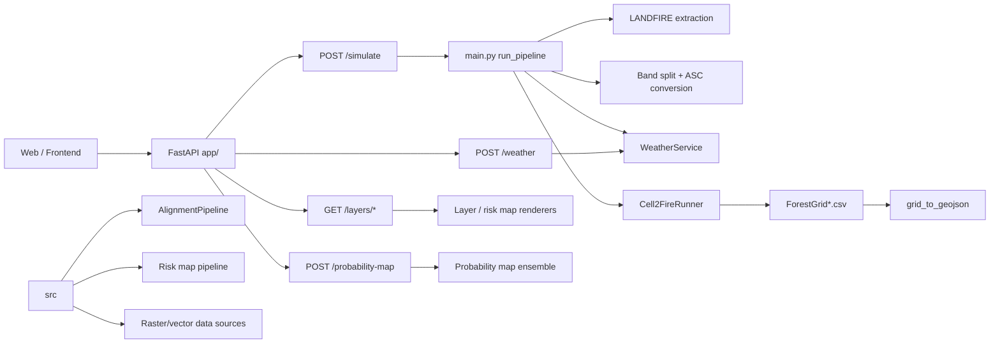

# Fuego Earth Backend Architecture Portfolio

## Executive Thesis

This repository demonstrates the ability to build a production-style geospatial backend that combines API design, spatial ETL, raster harmonization, simulation-engine orchestration, file-based caching, and postprocessing into a single wildfire product. The strongest signal is not any one endpoint; it is the repeated pattern of taking heterogeneous geospatial inputs, normalizing them onto a shared grid, and turning them into map-ready or simulation-ready artifacts with explicit CRS handling, deterministic cache keys, and test coverage around the contract.

At the same time, the repository also shows architectural evolution. The `app/` layer is a pragmatic FastAPI facade around a legacy orchestration path in `main.py`, while `src/` contains a more modular geospatial platform with reusable alignment, risk-map, and data-source abstractions. That split is useful evidence of engineering range, but it also creates some duplication and drift risk. A hiring committee would read this as a strong builder who has already learned the hard parts of production geospatial systems, but who still has some convergence work to do.

## System Architecture

The architecture is organized around a few stable ideas:

1. HTTP routes are thin and mostly validate, log, and dispatch.
2. Heavy geospatial work is pushed into services or pipeline objects.
3. Raster data is normalized to a shared grid before any pixel-wise math.
4. External dependencies are isolated behind explicit adapters: LANDFIRE, OpenMeteo/HRRR, Supabase auth, Cell2Fire, FARSITE, and OpenStreetMap.
5. Outputs are file-backed and idempotent, which makes caching and recovery possible without a database.

## Backend Architecture

The backend is a hybrid of two design styles.

The first is the production API shell in `app/`. It uses FastAPI, JWT auth, background tasks, GZip, and CORS in [app/__init__.py](app/__init__.py). The routes are domain-specific and intentionally narrow: simulation, layer visualization, weather lookup, download, probability mapping, auth, and health. This is a clean API surface for a geospatial product because the frontend needs clear contracts more than generic CRUD.

The second is the pipeline core in `main.py` and `src/`. `main.py` is a legacy-but-functional orchestrator that still owns the most critical wildfire flow end to end. It performs phase-based orchestration, file-system locking, symlink reuse, weather generation, ignition generation, engine execution, and final output generation. That makes it a good example of production pragmatism: the code clearly treats the simulation engine as an external system with its own constraints, rather than trying to hide it behind a leaky abstraction.

The strongest architectural pattern in the backend is the separation between:

1. Request validation at the edge.
2. Geospatial normalization in the middle.
3. Engine-specific file conversion at the boundary with Cell2Fire.
4. Map-ready serialization at the end.

That is the right shape for production spatial software.

The biggest architectural debt is duplication across `app/` and `src/`. Similar concepts exist in multiple layers: raster alignment, weather fetching, rendering, and slug construction. The repo demonstrates a strong ability to ship and evolve a system, but also shows the usual cost of iterative growth: some business logic is still mirrored in more than one place.

## Request Lifecycle

### POST /simulate

The request path is:

1. `app/routers/simulate.py` validates a `SimulationRequest`.
2. `app/services/simulation_service.py` computes geo and sim slugs, checks cache presence, and either returns cached output or calls `main.run_pipeline()`.
3. `main.py` runs the wildfire pipeline in phases.
4. `src/utils/grid_to_geojson.py` converts engine output into a GeoJSON FeatureCollection.
5. The service enriches the response with request metadata and weather source metadata.
6. `app/services/risk_layer_service.py` is scheduled asynchronously to build aligned background layers for map overlays and later downloads.

That lifecycle is a good example of a stateless API fronting a stateful geospatial workload. The API does not pretend the work is light; it directly models the expensive phases and the cache keys that control them.

### POST /probability-map

The request path is:

1. `app/routers/probability.py` validates an ensemble request.
2. The route writes a job record to a file-based queue in `data/jobs`.
3. A background thread runs `app/services/probability_service.py`.
4. The ensemble uses the Cell2Fire simulation path repeatedly with perturbed weather and ignition conditions.
5. Job status is polled from disk by job id.

This is not a distributed job system, but it is a sensible production compromise for long-running simulation workloads where the main requirement is to avoid HTTP timeouts and survive multiple gunicorn workers.

### GET /layers and /download

Layer serving is split into two classes of data:

1. LANDFIRE-derived layers in `data/instances/<geo_slug>/`.
2. Background-aligned risk-map layers in `data/risk_maps/<geo_slug>/aligned/`.

`app/routers/layers.py` serves colorized PNGs and metadata, while `app/routers/download.py` supports CRS and resolution conversion for exports. This is a strong product decision because it separates visual exploration from file export, and it keeps the frontend from having to understand rasterio or reprojection details.

## Spatial ETL

### Capability Ladder

| Level 1: Competency | Level 2: Workflow | Level 3: Implementation |
|---|---|---|
| Spatial data acquisition | Fetched external geospatial products for a bounded area of interest | LANDFIRE, OpenMeteo/ERA5, HRRR, Copernicus DEM, ESA WorldCover, OpenStreetMap, and FIRMS-style data-source adapters |
| Coordinate system engineering | Chose a working CRS and aligned all layers to one grid | `AlignmentPipeline`, `Grid.from_bbox()`, `Aligner.align()`, `transform_bounds()`, `reproject()`, `Resampling.nearest` or `bilinear` |
| Raster harmonization | Reprojected, resampled, and normalized heterogeneous rasters | `rasterio.open()`, `reproject()`, `calculate_default_transform()`, NaN nodata handling, LZW-compressed GeoTIFF outputs |
| Raster-to-ASCII conversion | Converted analysis rasters to engine-specific inputs | `Grid.to_asc()`, `Cell2FireHarmonizer`, `Forest.asc`, `elevation.asc`, `saz.asc` |
| Vectorization and postprocessing | Converted burn grids to map layers | `shapes()`, geometry union/simplify/buffer, CRS reprojection to WGS84, perimeter extraction |
| Map serving | Produced PNG overlays and bounds for Mapbox | GeoTIFF-to-PNG rendering, corner coordinates in NW/NE/SE/SW order, transparent nodata handling |

### What the pipeline actually does

The spatial ETL is not generic ETL. It is grid discipline.

The system repeatedly takes source data with different CRSs, extents, resolutions, data types, and semantics, then forces it into a shared analysis grid. That happens in the risk-map alignment path and in the wildfire simulation path. The common geometry primitives live in [src/core/alignment/grid.py](src/core/alignment/grid.py) and [src/core/alignment/aligner.py](src/core/alignment/aligner.py), while the operational pipeline wrapper lives in [src/core/alignment/pipeline.py](src/core/alignment/pipeline.py).

Important spatial operations recovered from the repository:

1. WGS84 bounding boxes are transformed into a working CRS.
2. Target width and height are derived from resolution and projected bounds.
3. Each raster is reprojected into the same transform and dimensions.
4. Nodata is normalized to NaN for arithmetic and scoring.
5. Categorical data uses nearest-neighbor resampling.
6. Continuous data uses bilinear resampling.
7. Outputs are serialized as GeoTIFFs for GIS consumers and Arc ASCII grids for Cell2Fire.

That is the core geospatial engineering skill in the repo: treating spatial reference alignment as a first-class contract rather than a downstream cleanup step.

### Why this architecture?

This architecture is the right tradeoff for a wildfire product because the data sources are heterogeneous and mostly external. If you attempted to keep rasters in their original CRSs and resolutions, every later stage would have to carry special-case logic. By normalizing once, the system makes scoring, rendering, and export deterministic.

### Alternatives and tradeoffs

1. A database-backed spatial warehouse would improve discoverability and indexing, but would add major complexity and would not help the engine-facing file formats.
2. A fully in-memory processing pipeline would be faster for small requests, but it would be brittle for long-running downloads and large rasters.
3. A distributed tiling architecture would scale better for regional risk maps, but it is overkill for the current workload and would make debugging harder.

## Wildfire Data Processing

### LANDFIRE acquisition

The wildfire pipeline begins with LANDFIRE data acquisition in `main.py`. The extractor fetches multi-band source rasters, and the pipeline caches them using a location-based slug that snaps nearby coordinates together. This is a smart production decision because the download step is the slowest and most failure-prone stage, so maximizing reuse has immediate user-visible value.

### Band extraction and fuel conversion

The LANDFIRE raster is then split into named single-band products by `LandfireProcessor`, and the Cell2Fire-specific harmonizer turns those into the ASCII inputs the engine expects. The repository shows awareness that not every file is just a raster: some are engine inputs with strict naming and format constraints.

This is an important engineering signal. The code is not merely transforming data; it is adapting between ecosystems with incompatible assumptions.

### Weather generation

Weather is handled as a separate temporal data stream. `WeatherService` fetches hourly weather anchors, with HRRR as an eligible first choice for covered U.S. points and OpenMeteo ERA5 as fallback. `WeatherGenerator` interpolates those hourly anchors into 5-minute rows, computes hourly FFMC using the Van Wagner formula, and writes a `Weather.csv` that the engine can ingest.

This demonstrates more than API integration. It shows physical-model awareness:

1. Meteorological direction is preserved in the source convention.
2. FFMC is computed sequentially, so prior row state matters.
3. The engine requires a fixed fire-period cadence, so the output is capped and aligned to simulation semantics.

### Ignition generation

`InstanceHelper.create_ignition_file()` transforms a WGS84 ignition click into a 1-indexed Cell2Fire cell id. It then falls back to the nearest burnable cell if the clicked location falls on a non-burnable fuel cell. That is a production-grade usability detail: it prevents the engine from failing just because the user clicked in water, pavement, or another non-burnable class.

### Postprocessing to GeoJSON

`src/utils/grid_to_geojson.py` turns burned grid CSVs into a FeatureCollection. It vectorizes burned cells, smooths and unions polygons, reprojects them to WGS84, builds incremental burned-area rings, and extracts per-step perimeters. It also attaches per-step weather data from `Weather.csv` so the frontend can animate conditions alongside spread.

This is a particularly strong piece of work because it proves the repository understands that wildfire visualization is spatiotemporal, not just geometric.

## Simulation Pipeline

### Cell2Fire as a first-class integration problem

The code treats Cell2Fire like a real external engine, not a library call.

The simulation path in `main.py` and `src/core/simulation/simulators/cell2fire/runner.py` does several things that production software must do when integrating a compiled simulation engine:

1. Isolates engine-specific input generation.
2. Uses a separate preprocess step to generate `Data.csv`.
3. Calls the C++ binary directly with explicit period lengths and limits.
4. Captures engine logs to a file for debugging.
5. Enforces a timeout.
6. Verifies output files exist even when the process exits successfully.
7. Cleans up partial output on failure so the next run starts cleanly.

That is exactly how a senior engineer should handle a brittle simulation dependency.

### Input generation

The simulation input path is highly structured:

1. `InstanceHelper` creates ignition data and fuel rule aliases.
2. `Cell2FireHarmonizer` writes engine-specific ASCII rasters.
3. `WeatherGenerator` writes `Weather.csv` at 5-minute intervals.
4. `Cell2FireRunner` launches the Python wrapper and then the native binary.

The repository also uses symlinked instance directories so a geo_slug terrain cache can be reused across multiple weather combinations without duplicating large raster files. That is an excellent storage-efficiency pattern for a product that will likely generate many runs from the same location.

### Output parsing

The engine output is parsed from `ForestGrid*.csv` files and converted to map geometries. The postprocessing stage is aware of engine quirks, such as duplicated final grids, and the tests explicitly enforce that behavior is handled correctly.

### Performance bottlenecks and mitigations

The code implicitly shows the main bottlenecks:

1. External API latency, especially LANDFIRE.
2. Raster reprojection and resampling cost.
3. Cell2Fire CPU time.
4. Disk I/O for large GeoTIFFs and CSV grids.
5. GeoJSON vectorization and simplification for final output.

The mitigations are equally clear:

1. On-disk caching by geo_slug and sim_slug.
2. Reuse of symlinked terrain directories.
3. Background task generation for noncritical risk-map layers.
4. Output validation before accepting a run as successful.
5. Separate cache layers for terrain and simulation results.

## API Design

The API design is mostly good engineering for a geospatial product.

### Strengths

1. Routes are grouped by domain: simulate, layers, weather, download, probability, auth, health.
2. Pydantic models define request contracts and validation boundaries.
3. Error mapping is explicit: 404 for missing data, 422 for invalid inputs, 500 for pipeline failure.
4. Background tasks are used for work that should not block the main response path.
5. Response shapes are aligned with frontend mapping and image-source needs.

### Weak spots

1. Some contracts are in transition. The current `SimulationRequest` in [app/schemas/simulation.py](app/schemas/simulation.py) is date/simulator-driven, while `tests/test_api.py` still documents a legacy weather-slider payload. That suggests test or API drift.
2. Auth is permissive when `SUPABASE_URL` is missing, which is practical in development but risky if misconfigured in production.
3. File-based jobs in `app/routers/probability.py` are simple and robust enough for a small deployment, but they are not a substitute for a real queue when concurrency grows.
4. The route layer still contains some routing knowledge that ideally belongs in shared service code.

### Why this design?

The design optimizes for clarity, debuggability, and deployability over abstraction purity. That is a sensible choice for a geospatial backend with costly external dependencies. The frontend needs predictable endpoint contracts and the operators need inspectable disk artifacts more than they need a perfect service mesh.

## Software Engineering Patterns

The repository demonstrates several mature patterns:

1. Thin controllers, heavier services.
2. Explicit typed request/response models.
3. Pipeline stages with clear boundaries.
4. Adapter pattern for external data sources and engines.
5. File-system caching keyed by deterministic slugs.
6. Idempotent background work where possible.
7. Contract tests for API and GeoJSON outputs.

It also demonstrates a practical version of boundary-driven design. The code does not over-abstract the engine or the raster workflows. Instead, it isolates them just enough to make them testable and maintainable.

## Performance Engineering

The performance story is solid for a single-node geospatial backend.

### What the repository gets right

1. It minimizes repeated downloads by caching raw terrain data by location.
2. It avoids duplicating large terrain rasters across simulations by using symlinks.
3. It batches aligned risk-map layers that share a grid spec.
4. It keeps the HTTP response fast for long jobs by using background tasks or job polling.
5. It validates engine output before reporting success.

### What would become limits at larger scale

1. File-system cache invalidation will become hard to reason about across multiple hosts.
2. Thread-based background jobs are not a real queue.
3. Large raster reprojections are CPU and memory intensive, and there is no explicit chunking or distributed execution.
4. The system is still mostly single-node and shared-disk oriented.

### Scalability assessment

This is a strong design for a focused product or a pilot deployment. It is not yet a horizontally scalable geospatial platform, but it contains several of the right primitives if you wanted to evolve it in that direction.

## Deployment

The deployment story is practical and production-minded.

1. `Dockerfile` and `Procfile` imply container and process-manager deployment readiness.
2. `gunicorn.conf.py` indicates a production WSGI/ASGI serving setup rather than a dev-only app.
3. `run.py` provides a direct Uvicorn entry point for local development.
4. Environment variables control engine paths, email configuration, CORS, and auth integration.
5. On-disk data directories are first-class deployment artifacts, not incidental temp files.

This repository is optimized for the common geospatial pattern where the application container ships with native binaries and relies on a mounted volume for cache persistence.

## Testing

The test strategy is one of the strongest signals in the repository.

### Coverage shape

1. API smoke tests validate HTTP routing, validation, and contract structure in [tests/test_api.py](tests/test_api.py).
2. Integration tests exercise the full simulation pipeline in [tests/test_pipeline.py](tests/test_pipeline.py).
3. Spatial alignment tests validate grid math, reprojection, and export formats in [tests/unit/test_alignment.py](tests/unit/test_alignment.py).
4. Raster harmonization tests validate band splitting and ASC conversion in [tests/test_harmonizer.py](tests/test_harmonizer.py).
5. GeoJSON postprocessing tests validate polygon generation, step metadata, and WGS84 output in [tests/utils/test_grid_to_geojson.py](tests/utils/test_grid_to_geojson.py).
6. Smoke tests for individual extractors cover external data-source adapters.

### What this says about engineering maturity

The repo does not just test happy-path outputs. It tests the contracts that matter in production:

1. Coordinates must be WGS84 when they reach the frontend.
2. GeoJSON must preserve timeline semantics.
3. ASCII headers must be engine-compatible.
4. The pipeline must fail cleanly and isolate partial output.
5. Output files must reflect actual raster dimensions and CRS.

That is exactly what strong geospatial testing should look like.

### Gaps

1. Several tests still look synchronized to an older API contract, which suggests a maintenance debt between evolving code and test fixtures.
2. There is no obvious end-to-end browser or frontend integration coverage in the repository.
3. There is no evidence of load testing, benchmark baselines, or concurrency tests for the job system.

## Resume Translation Matrix

| Resume Claim | What the Repo Demonstrates | Evidence |
|---|---|---|
| Built production geospatial APIs | FastAPI service with typed request models, auth, CORS, GZip, and domain routers | [app/__init__.py](app/__init__.py), [app/routers/simulate.py](app/routers/simulate.py), [app/routers/download.py](app/routers/download.py) |
| Designed spatial ETL pipelines | CRS-aware alignment, reprojection, raster harmonization, ASCII export | [src/core/alignment/pipeline.py](src/core/alignment/pipeline.py), [src/core/alignment/aligner.py](src/core/alignment/aligner.py), [src/core/alignment/grid.py](src/core/alignment/grid.py) |
| Integrated external geospatial data sources | LANDFIRE, DEM, WorldCover, OSM, OpenMeteo, HRRR, Supabase auth | [main.py](main.py), [src/services_risk_map/weather_service.py](src/services_risk_map/weather_service.py), [app/auth/dependencies.py](app/auth/dependencies.py) |
| Orchestrated simulation engines | Cell2Fire preprocessing, binary execution, timeout handling, output validation | [main.py](main.py), [src/core/simulation/simulators/cell2fire/runner.py](src/core/simulation/simulators/cell2fire/runner.py) |
| Built map-ready outputs | GeoJSON conversion, WGS84 corner generation, PNG rendering | [src/utils/grid_to_geojson.py](src/utils/grid_to_geojson.py), [app/services/layer_service.py](app/services/layer_service.py), [src/core/risk_map/rendering/renderer.py](src/core/risk_map/rendering/renderer.py) |
| Designed caching and resilience | Deterministic slugs, file-backed caches, symlink reuse, background layer generation | [app/services/simulation_service.py](app/services/simulation_service.py), [main.py](main.py), [app/services/risk_layer_service.py](app/services/risk_layer_service.py) |
| Wrote contract-driven tests | API contract tests, raster alignment tests, GeoJSON integration tests | [tests/test_api.py](tests/test_api.py), [tests/unit/test_alignment.py](tests/unit/test_alignment.py), [tests/test_pipeline.py](tests/test_pipeline.py) |

## STAR Stories

### 1. Long-running wildfire simulation jobs

Situation: A simulation request can take minutes because it depends on external raster downloads and a compiled fire engine.

Task: Return results through an HTTP API without timing out or leaving users blind to progress.

Action: The backend split fast validation from slow work, cached by deterministic slugs, used file-backed artifacts for state, and exposed a job-polling pattern for ensemble workloads.

Result: The API remains responsive while the simulation pipeline produces deterministic, cacheable outputs.

### 2. CRS-safe geospatial alignment

Situation: The system consumes rasters from multiple providers with different projections and resolutions.

Task: Make them usable together for scoring, rendering, and export.

Action: The code introduced a shared grid abstraction, chose a working CRS, and aligned each layer to one transform and pixel size before doing any pixel-wise operations.

Result: The backend can score, render, and export heterogeneous geospatial layers without ad hoc per-source logic.

### 3. Engine integration under real constraints

Situation: Cell2Fire has hard input formats, timing limits, and output quirks.

Task: Make the engine behave like a reliable backend component.

Action: The repository generates exact ASCII inputs, caps weather rows, captures logs, verifies outputs exist, and cleans failed runs before retry.

Result: The engine is treated as a controlled dependency instead of an opaque failure source.

### 4. Map visualization from simulation output

Situation: The frontend needs geospatial output that can be animated over time and pinned to map imagery.

Task: Turn raw grid outputs into a frontend-friendly spatiotemporal contract.

Action: The converter vectorizes burned cells, builds incremental burn rings and perimeters, reprojects to WGS84, and attaches step-wise weather metadata.

Result: The frontend gets map-ready GeoJSON instead of raw engine artifacts.

## Interview Questions

You can expect this repository to support answers to questions like:

1. How do you design a geospatial API around expensive external data sources?
2. How do you choose a working CRS for regional raster analysis?
3. How do you prevent repeated downloads in a wildfire simulation platform?
4. How do you bridge Python preprocessing and a native C++ engine?
5. How do you convert engine outputs into frontend-ready map overlays?
6. What do you cache on disk, and how do you make cache keys deterministic?
7. How do you handle non-burnable ignition points?
8. What fails first in a wildfire simulation pipeline, and how do you make failure diagnosable?
9. How do you test spatial transformations without real network access?
10. Where would you introduce a queue or object store if load increased?

## Evidence Mapping

### API and orchestration

1. [app/__init__.py](app/__init__.py)
2. [app/routers/simulate.py](app/routers/simulate.py)
3. [app/services/simulation_service.py](app/services/simulation_service.py)
4. [main.py](main.py)

### Spatial alignment and export

1. [src/core/alignment/pipeline.py](src/core/alignment/pipeline.py)
2. [src/core/alignment/grid.py](src/core/alignment/grid.py)
3. [src/core/alignment/aligner.py](src/core/alignment/aligner.py)
4. [src/utils/grid_to_geojson.py](src/utils/grid_to_geojson.py)

### Cell2Fire integration

1. [src/core/simulation/simulators/cell2fire/weather.py](src/core/simulation/simulators/cell2fire/weather.py)
2. [src/core/simulation/simulators/cell2fire/instance.py](src/core/simulation/simulators/cell2fire/instance.py)
3. [src/core/simulation/simulators/cell2fire/harmonizer.py](src/core/simulation/simulators/cell2fire/harmonizer.py)
4. [src/core/simulation/simulators/cell2fire/runner.py](src/core/simulation/simulators/cell2fire/runner.py)

### Layer serving and risk-map support

1. [app/services/layer_service.py](app/services/layer_service.py)
2. [app/services/risk_layer_service.py](app/services/risk_layer_service.py)
3. [app/routers/download.py](app/routers/download.py)
4. [src/core/pipeline.py](src/core/pipeline.py)
5. [src/core/risk_map/rendering/renderer.py](src/core/risk_map/rendering/renderer.py)

### Testing

1. [tests/test_api.py](tests/test_api.py)
2. [tests/test_pipeline.py](tests/test_pipeline.py)
3. [tests/test_harmonizer.py](tests/test_harmonizer.py)
4. [tests/unit/test_alignment.py](tests/unit/test_alignment.py)
5. [tests/utils/test_grid_to_geojson.py](tests/utils/test_grid_to_geojson.py)

## Unknowns

These are the main areas that remain unclear or partially proven from the repository itself:

1. The long-term production boundary between `app/` and `src/` is not fully settled.
2. The risk-map pipeline in `src/core/pipeline.py` appears structurally strong, but parts of that subtree still look like work in progress.
3. The repository does not show a real queue, object store, or multi-host deployment topology.
4. Some API tests appear to reflect an older request schema, so contract drift is a maintenance risk.
5. Auth is only as strong as runtime configuration; dev-mode bypass is practical but must be controlled carefully.
6. There is no visible benchmark suite for raster alignment or engine throughput.

## Bottom Line

This repository demonstrates a strong ability to build production geospatial systems because it handles the hardest parts correctly: CRS discipline, raster harmonization, engine integration, on-disk caching, spatial postprocessing, and testable API contracts. The code shows real experience with the operational realities of wildfire simulation infrastructure, not just application scaffolding.

If this were being reviewed for hiring, the main positive signal would be: the author understands both the geospatial math and the production mechanics required to ship a real wildfire backend. The main caution would be that the system is still in an evolutionary state, with some legacy and modular paths coexisting. That is normal for a growing codebase, but it is also the most obvious area for future cleanup.