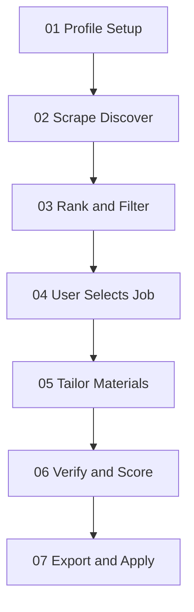

# Extern Job Intelligence & Application Pipeline

This document defines the full pipeline: deterministic job intelligence (scrape → rank) followed by the application workflow (tailor → verify → export).

---

## Intelligence Pipeline (TypeScript)

### Stage 1: Profile Setup
*   **Goal**: Establish master experience database, function profiles, and hard-filter constraints.
*   **Command**: `npm run setup` / `skills/setup/`
*   **Artifacts**:
    *   `library/context/experience/` — projects, internships, research, skills, achievements (source of truth)
    *   `library/profiles/` — function-specific resume presentation layers
    *   `library/context/constraints.md` — visa, location, experience ceiling
*   `library/context/career_goals.md` — target roles/industries (scrape builds query plan; Search Queries optional)
*   `library/context/target_sources.md` — discovery strategy index
*   `library/context/discovery/` — climate boards, VC portfolios, accelerators, target companies, ATS boards
*   `library/domain/climate_ontology.json` — climate/EO domain keywords for discovery + rank
*   `library/context/master-cv.md` — aggregated fallback for legacy skills

### Stage 2: Job Discovery (Scrape)
*   **Goal**: Discover jobs via TinyFish + ATS feeds, normalize to canonical schema.
*   **Command**: `npm run scrape` / `skills/scrape/`
*   **Artifacts**: `workspace/jobs/normalized/{id}.json`

### Stage 3: Rank & Filter
*   **Goal**: Classify job function, apply hard filters, generate optimization plan, assign tier S/A/B/C/D.
*   **Command**: `npm run rank` / `skills/rank/`
*   **Artifacts**:
    *   `workspace/jobs/ranked/{id}/decision-report.json`
    *   `workspace/jobs/ranked/{id}/optimized-resume-plan.json`
    *   `workspace/jobs/rejected/{id}.json` (hard-filtered)
*   **Rules**:
    *   Hard filters (visa, experience, licenses) reject immediately
    *   Fixable mismatches are NEVER rejected before optimization
    *   Company research does NOT run during rank

### Stage 4: User Selects Job
*   **Command**: `npm run apply <jobId>` / `skills/apply/`
*   **Artifacts**: `workspace/applications/{company}-{role}/` with `job.md`, `verdict.json`

---

## Application Pipeline (Agent Skills)

### Stage 5: Tailor Materials (draft-review)
*   **Goal**: Generate customized resume and cover letter via drafter-reviewer loop.
*   **Skill**: `draft-review` (Tier S/A recommended) — orchestrates `cv` + `cover-letter` rules internally
*   **Quick path** (Tier B): `cv` → `cover-letter` without reviewer
*   **Artifacts**:
    *   `cv-v1.md`, `cover-letter-v1.md` (revised after reviewer pass)
    *   `review-feedback-v1.json` (structured reviewer edits + narrative suggestions)
    *   `cv-v1.pdf`, `cover-letter-v1.pdf` (after mandatory layout inspection)
*   **Input**: `optimized-resume-plan.json` + `library/profiles/{profile}`

### Stage 4b: Company Research (GATED)
*   **Goal**: Cited research brief for interview prep and cover letter hooks.
*   **Skill**: `company-research`
*   **Gate**: Only after user selects job OR Tier S + apply initiated
*   **Artifact**: `research-brief-v1.md`

### Stage 6: Verification
*   **Goal**: Audit final materials (NOT job fit scoring).
*   **Skill**: `verifier`
*   **Artifacts**: `cv-verification-report.md`, `cover-letter-verification-report.md`

### Stage 7: Export & Apply
*   **Goal**: Render PDF/Word and update tracker.
*   **Skills**: `doc-export`
*   **Artifacts**: `cv-v1.pdf`, `cover-letter-v1.pdf`
*   **Tracker**: Update `workspace/applications/tracker.md` to `submitted`

---

## Tier Classification

| Tier | Action |
|---|---|
| S | Apply immediately |
| A | Strong apply |
| B | Conditional apply |
| C | Low ROI |
| D | Reject (hard blockers) |

---

## Legacy: Manual Job Pull

`skills/find-job/` remains available for single-job paste/ATS pull outside the scrape pipeline.
